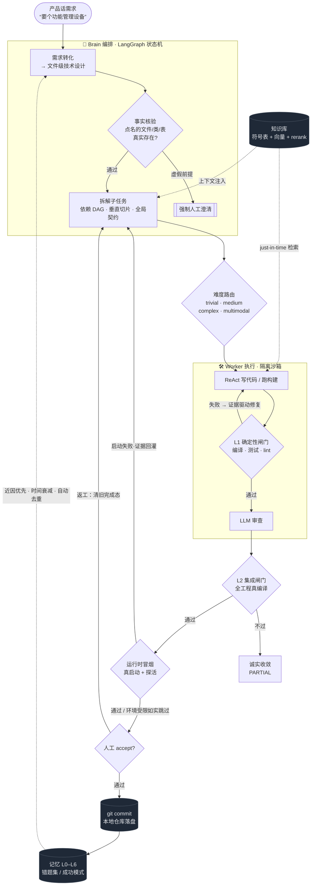
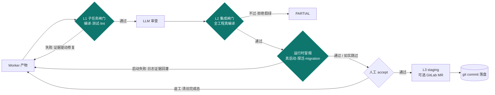
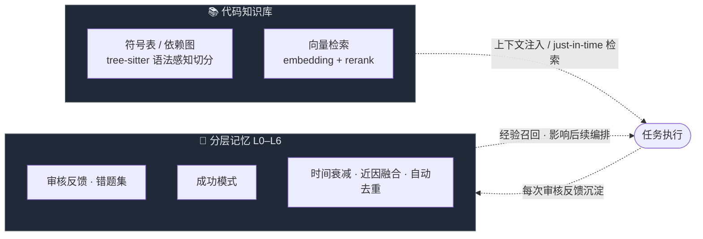

<div align="center">

# 🐝 Swarm

### 对交付结果负责的多智能体工程系统

*不是又一个 AI 编程助手 —— 而是一支接过整个需求、自己拆解执行、跑完验证再交还给你的自主工程班子。*

<br/>

[](https://github.com/Victzhang79/Swarm/actions/workflows/ci.yml)
[](LICENSE)
[](https://www.python.org/)
[](https://github.com/langchain-ai/langgraph)
[](#-测试)
[](https://github.com/Victzhang79/Swarm/releases)
[](#)

<br/>

**产品话需求进 · 生产级产物出 · 每一步可追溯**

[💡 为什么](#-为什么需要-swarm) ·
[🎬 30 秒看懂](#-30-秒看懂) ·
[🔄 工作原理](#-工作原理) ·
[🧬 核心机制](#-核心机制) ·
[🛡️ 安全模型](#️-安全模型) ·
[📈 可观测](#-可观测与运维探针) ·
[🚀 快速开始](#-快速开始) ·
[🏗️ 架构](#️-架构一览)

</div>

---

## 💡 为什么需要 Swarm

大模型很会写代码 —— 但**也很会自信地交付错的东西**。

在"满地都是编程智能体"的今天，瓶颈早已不是"让 AI 写出代码"，而是：

> **怎么让一群自主的 AI，在没人盯着时，把活干对、干完、且每一步可追溯？**

Swarm 把一个需求交给一套**有分工、有验证、有记忆**的智能体团队。它的每一层设计，都在回答同一个问题——*当没有人逐行把关时，凭什么相信交付物是对的。*

| | 🧑‍✈️ 副驾式助手<br/>(Cursor / Copilot / Claude Code) | 🐝 Swarm |
|---|---|---|
| **协作形态** | 坐你旁边帮你写，你逐行把关 | 接过整个需求，自己拆解执行、跑完验证再交还 |
| **优化目标** | 单人手速 | **无人值守下的交付可信度** |
| **验证方式** | 你来判断对不对 | **确定性闸门**（编译/测试/lint）先卡，再 LLM 审查，最后人工 accept |
| **失败处理** | 你接手救场 | **逐级恢复阶梯** + 诚实部分交付，绝不推倒已成功的工作 |
| **越用越懂你** | 每次从零开始 | **分层记忆**沉淀每次审核反馈，越用越懂你的项目 |

> 智能体越自主，"可信交付"这一层就越不可或缺 —— 这正是 Swarm 优化的地方。

---

## 🎬 30 秒看懂

**一句话产品需求 → 全栈模块端到端跑通、编译通过、可运行。**

```
你：            “想要个功能管理设备”
                        │
  Brain 翻译成文件级技术设计（建什么表 / 按分层规范建哪些文件）
                        │
  拆解为依赖 DAG · 垂直切片 · 全局契约
                        ▼
┌──────────────── 系统自主产出 ────────────────┐
│  📄 Device.java              (实体)            │
│  📄 DeviceMapper.java + .xml (持久层)          │
│  📄 DeviceService(+Impl).java(业务层)          │
│  📄 DeviceController.java    (接口层)          │
│  📄 device.html / device.js  (前端)            │
│  🗄️ sys_device               (建表 SQL)        │
└───────────────────────────────────────────────┘
             ✅ L1 编译通过   ✅ L2 集成编译   ✅ 可运行
```

多数情况无需你点名改哪个文件或逐行审查 —— 你描述"要什么"，Swarm 负责"怎么对地做出来"（复杂/多模块/工具链缺失的任务可能需人工 accept、澄清或介入，见下文 PARTIAL 交付与人工闸）。

> 上面演示的是 Java 单体项目；**同一套编排对 Go / Rust / TypeScript / Python / Vue 前后端分离项目同样成立**——
> 技术栈由磁盘探测权威判定（不信文档自述），分层规范、构建命令、验收标准、确定性修复工具链全部随栈切换，
> 规划 prompt 与拆分逻辑中不写死任何单一栈或示例项目（详见「多技术栈支持」）。

---

## 🔄 工作原理

一个需求从进入到落盘，流经 **Brain 编排 → 难度路由 → Worker 沙箱执行 → 三层验证 → 记忆闭环**：



---

## 🧬 核心机制

Swarm 的可信度不来自"换个更强的模型"，而来自四组系统性设计。

### 🔒 可信交付：不把"模型说它对了"当成"它真的对了"

**三层验证，层层设卡**——LLM 自评之前，先用确定性证据卡一道硬标准：



- **确定性闸门优先**：产物先过 L1 硬闸门（编译/测试/lint），**再**走 LLM 审查，最后人工 accept。修复轮用真实编译/lint 证据驱动，返工时清空旧完成态、防"提前宣告完成"。
- **集成级不假绿**：L2 对全工程做真编译（Java 多模块 reactor / 各栈对应构建）；工具链缺失时**拒绝放行而非静默跳过**，绝不把"没验证"当"验证通过"。纯 docs/config、无构建文件的子任务合理跳过编译（`compile_ok=None`，非假绿）。
- **运行时冒烟闸门**（v0.9.22）：编译通过不等于跑得起来——L2 后在沙箱**真启动应用**（manifest 证据推导启动命令/端口，多栈对称）+ TCP/HTTP 探活 + migration 执行验证。启动失败按证据三分类：代码错误→启动日志回灌定向修复（有界）；环境缺失（沙箱无外部 DB 等）→**如实跳过绝不冤枉代码**；分类不明→保守跳过。所有跳过带原因进交付报告（`degraded_reasons`），跳过轮不写入成功记忆。
- **PRD 覆盖矩阵 + 验收断言**（v0.9.23）：需求先结构化为条目清单（每条**回指原文引文**确定性校验，防 LLM 幻觉需求）；计划期每个子任务声明覆盖哪些条目，**未覆盖的需求→拒绝计划回灌重规划**（有界）；条目再生成可执行验收断言（如 `POST /api/xxx → 201`），冒烟阶段对**真启动的应用**逐条执行——接口行为不符预期按断言证据回灌定向修复；推不出可自动验证形态的（如需登录态）如实标 manual 交人工。人工审核 payload 完整呈现覆盖矩阵+断言结果+冒烟/migration 结论。
- **存量能力申报通道**（v0.9.24）：棕地项目的 PRD 常描述**基线已有**的能力——计划期可申报「该需求现有代码已满足」（必须给出依据），覆盖对账=新实现∪合法申报，不再逼系统为存量功能造子任务；申报是承诺：可自动验证的条目会在冒烟阶段真执行断言核查，核不了的（如需登录态）如实降级标记并在人工审核 payload 呈现「哪些条目是声称基线已有」供否决（`SWARM_BASELINE_STRICT_GATE` 可升级为未核实即拒绝自动放行）。臆造需求条目 ID 有确定性近邻提示；重规划回灌带上一版计划摘要做**增量修补**防反复全量重拆。
- **事实核验前置**：规划前先核对需求点名的文件/类/表是否**真实存在**——虚假前提强制转人工澄清而非硬跑。存在性同时查**工作区磁盘**与 **git 已跟踪**两个 ground truth，不依赖可能滞后的索引。

**失败不是"全有或全无"——它走一条逐级消化的恢复阶梯：**


> **全程绝不因一个子任务失败就推倒已成功的工作重来**；依赖了已放弃上游的下游子任务会被一并干净放弃、任务确定性收敛到 `PARTIAL`——绝不空转卡死或反复推倒重规划。

<details>
<summary><b>🔧 展开：更多确定性加固机制</b></summary>

<br/>

- **栈权威 + 机械错误确定性自修**：技术栈由**磁盘探测权威定栈**（不以需求文档为准——文档常把栈写错）并注入每个 Worker（如"本项目用 `jakarta` 不用 `javax`"）。探测还**钉死项目真实存在的基建符号**（缓存/响应/鉴权/基类的真实 FQN）——小模型只能复用项目真有的类，**禁止臆造不存在的"标准类"**（如某变体并没有的 `RedisCache`）。万一仍写错，L1 **不靠换模型**，而是按生态委托事实标准工具**确定性修复**后重跑构建确认（Java 据自身现存 import/依赖自证、Go=`goimports`、Rust=`cargo fix`、前端=`eslint --fix`）；缺依赖据自身 pom 补全、**错版本号**查仓库真实版本校正。对确实**无法自修**的臆造（引用基线里根本不存在、也没有任何子任务会产出的包/类）——**确定性识别并硬失败该子任务**，不再一遍遍重试空耗；与"基线真有、只是沙箱一时没同步"严格区分——后者继续等待落地而非误杀。
- **模型不可用自动降级**：每个 Worker 模型（含并行轮转的 override 模型）都带**多级 fallback 链**，某模型被推理端点中途下线（`Model not found` 等）时自动逐级切到备选，不让单个模型抖动拖垮整轮。
- **跨子任务文件同步免空转**：消费方读一个【尚未由别的子任务建出】的文件时，不返回看似可重试的"读取失败"让小模型反复重读空转——而是**按文件名在工程树自动定位**（补全裸类名为完整包路径），确实尚未落地的给**明确止转信号**让其按现有上下文继续；其引用待集成期由 build 侧 `BLOCKED` 退避重试自然消解。
- **共享契约并集合并·不丢方法**：多模块逐模块生成契约再合并时，采用**按方法/字段并集**而非"保留首版丢弃其余"——同名接口的所有方法都进全局契约，杜绝"被丢版独有方法缺失→下游 cannot-find-method"。
- **并行产物零丢失·聚合文件不互相覆盖**：多个子任务并行改同一聚合清单（根 `pom.xml`/`settings.gradle`/`Cargo.toml`/`go.work`/`.sln`）时，每个 Worker 改动**以自身产出独立成 diff**，合并时同锚点按**并集**收拢——任何一方的模块/依赖登记都不会丢。
- **工作量不超执行预算·大块先拆再干**：派发前确定性保证每个子任务**文件数不超上界**，超界的**先按实体/分层拆小**再进 Worker；万一仍超时，**第一恢复动作就是拆小**（而非反复换模型磨到超时）。
- **系统性 fail-closed 加固**：默认拒绝（安全/正确性状态缺省判否）、数据先写后删（重建索引写新代际成功再删旧；同文件并发 reindex 仍存代际 prune 竞态，非完全并发安全）、临时验证回滚**仅限改动涉及文件**（绝不整库 `clean -fd` 抹用户改动）、读路径补 workspace 边界复校、跨项目资源按归属鉴权。
- **大型多模块工程交付韧性**：根 pom **写权收敛唯一属主**、内部模块**依赖版本完整性闸门**、**未注册模块 fail-closed**、模块级校验**不连坐无关兄弟**、交付**按文件独立落盘**（单个坏补丁不连坐清零其余几十个正确产物）。把"一个子任务塞进 N 个同层独立实现"**确定性拆成一实现一子任务**，并按声明依赖预注入**常被幻觉的三方库正确 API 签名**。

</details>

### 🧠 编排与分工：产品经理式需求，自动并行

- **产品话即可**：只描述"要什么功能"，无需点名改哪个文件——系统先把模糊需求翻译成文件级技术方案再规划。
- **垂直切片 + 自动并行**：一个跨多文件的完整功能作为一个子任务交付，而非按文件数拆碎；剥离 LLM 误加的"假依赖"让真正独立的子任务并行（DAG 驱动），merge 冲突检测兜底。
- **超大型需求分批拆解**：上百文件按功能模块分批（逐批可见进度）；多模块并行前先由 Brain 产出**全局共享契约**（跨模块接口/DTO/API 规范）注入每个 Worker，确保接口对得上。

### 📚 知识库 + 记忆闭环：越用越懂你的项目



- **代码知识库**：符号表 + 向量检索（embedding + rerank，可配云端或自建），为每个任务精准注入相关代码；Worker 还可 just-in-time 即时检索。多语言语法感知切分 + 多源资料采集（PDF/Word/HTML/图片 + 语雀）。
- **分层记忆 L0–L6**：每次审核反馈沉淀为记忆，影响后续编排与生成。**时间感知衰减**让半年前的坏案例自动淡出、新鲜教训优先；**近因融合排序** + **cross-encoder 精排**提升召回精度；**批量碎片整合**自动合并近义重复，库越用越干净。
- **可观测**：记忆健康度端点暴露规模 / 有效权重分布 / 去重率，写入幂等防重放双计数。

### 🌐 多技术栈支持：不是"支持 Java 顺带其它"，而是栈无关设计

| 能力层 | 覆盖 | 机制 |
|---|---|---|
| 栈探测 | Java/Go/Rust/TS·JS/Python/Vue 混编 | 磁盘 manifest 权威定栈（pom/gradle/go.mod/Cargo.toml/package.json/pyproject），不信需求文档自述 |
| 构建/验收 | 按栈自动 | `mvn`/`gradle`/`go build`/`cargo build`/`npm build`/py_compile；子任务验收命令随 harness 走，不写死任何栈 |
| Lint | 5 语言 | checkstyle / go vet / clippy / eslint / ruff（工具故障≠代码错误，瞬时基础设施故障单独识别） |
| 确定性修复 | Java/Go/Rust/TS | 按生态委托事实标准工具：Java import/依赖自证、`goimports`、`cargo fix`、`eslint --fix` |
| 依赖补全 | Maven/npm/cargo/go | 从**项目自身兄弟 manifest** 找权威坐标注入（只用自证坐标、绝不臆造、fail-closed） |
| 分层模板 | Java/Vue/TS/Go/Python | 新建文件按栈找同类既有文件做范例注入，免全项目探索空烧预算 |
| 规划去特化 | 全部 | 分组/拆分/prompt 中无任何项目专名或单栈写死（有回归测试锁定不得回流） |

### 🛠️ 工程化：开箱即用、生产安全

- **混合模型路由**：子任务按难度路由不同模型，Worker 层默认**本地小模型并行** + 多级兜底链（主力失败逐级降级，全本地不外溢），Brain 用大模型；可接任意 OpenAI 兼容接入点，WebUI 可视化配置。
- **小模型友好的上下文治理**：ReAct 历史按 token 预算裁剪、文件按需局部读取、子任务 scope 精确收窄，让小模型也能稳定干活。
- **产出持久化**：验证通过自动 git commit 到**本地仓库**（不 push），确保落盘稳定、下个任务能看到最新状态。
- **沙箱模板自愈**：起隔离沙箱时按沙箱服务**真实可用清单**解析模板——配置的模板 ID 若失效自动改用服务器现存、**优先项目匹配**的镜像，杜绝"死配一个不存在的模板 ID 就全员失败/静默降级本地"。
- **生产模式安全自检**：`SWARM_ENV=production` 启动做 fail-closed 自检——弱根密钥/默认 admin 口令拒绝启动。配置/敏感 Key 加密存储，WebUI 保存即生效。

### 🔬 系统自身如何被验证（工程纪律）

一个替你交付代码的系统，自己的代码必须经得起同样的标准：

- **2500+ 行为测试**在全新空 PostgreSQL + Python 3.12 的 CI 上全量跑，每个 commit 必绿才合入；测试写**行为断言**而非结构断言（不焊死实现，重构不脆）。
- **每个修复批次经双重对抗复核**（开发流程自述，非 CI 自动门禁：独立 code-reviewer + silent-failure-hunter 逐条核实），复核抓到的问题当批整改；关键判定（如"某疑似 bug 实为 fail-safe"）须三方证据链一致才定案。
- **关键路由有回归测试**：图编译 + 节点存在性 smoke 测试 + 关键路由函数（`after_merge`/`after_monitor` 等）行为单测覆盖主要分支。**非形式化全图证明**——CODEWALK 审计历史上仍发现过路由粘滞/死链并逐一修复。
- **状态通道 schema 一致性有 AST 守卫**：LangGraph 对未声明的状态键会静默丢弃（实证），因此"节点写的每个键必须在 schema 声明"由测试强制——杜绝写了没人收到的死功能。
- **fail-closed 是默认哲学**：安全/正确性状态缺省判否、工具跑不了绝不当"验证通过"、降级必可观测、解析失败按未扫处理——宁可诚实报 PARTIAL，不静默假绿。

---

## 🛡️ 安全模型

面向**内网多用户**部署形态设计，每一层都有明确的信任边界：

| 层 | 机制 |
|---|---|
| **认证/授权** | 多用户 Token + RBAC（全局角色 + 项目级成员权限）；首次登录强制改密；Token 存库为 SHA256 at-rest 哈希、登录轮换（明文不落库）；`SWARM_TOKEN_TTL_HOURS` 可选限令牌暴露窗口（**默认 0=永不过期，需显式配置**；生产模式仅告警不阻断） |
| **浏览器会话** | 浏览器主路径优先 **HttpOnly Cookie**，HTTP 不再走 `?token=` URL（避免日志/Referer 泄漏）；程序化客户端走 `Authorization` Header；**WebSocket 仍保留 `?token=` 最弱兜底**，登录/建用户 JSON 响应仍会回一次性 token（前端 boot 用）。失权即断流，不静默重连 |
| **API 面收权** | `/api/status` 等暴露基建拓扑的端点需鉴权；`/docs` `/openapi.json` **生产环境默认纳入鉴权**（`SWARM_DOCS_PUBLIC` 双向覆盖，配置异常 fail-closed 拒绝而非 500） |
| **命令执行** | Worker 沙箱命令过 **hardened 黑名单**（规则库存 DB 可管理，加载异常回退内置基线绝不放行 `rm -rf /` 类）；所有承载 agent 命令的路径（含遗留兜底）统一过闸 |
| **执行隔离** | 沙箱执行隔离由 CubeSandbox 提供（非 root/网络策略/资源限额取决于远端沙箱与模板配置，非 Swarm 代码强制校验）；Swarm 侧为 SDK 客户端 + 模板自愈。主机与目标项目工作区经路径边界校验，防穿越 |
| **密钥管理** | LLM Key 等经 `secret_store` 加密落库；提交/日志有敏感信息扫描纪律 |
| **生产门禁** | `SWARM_ENV=production` 启动自检：弱根密钥/默认口令/弱 DB 凭据/未开 RBAC → **拒绝启动**；运行期热更新改出不安全配置 → 原子回滚拒绝落盘 |
| **注入面治理** | 关键路径 shell 拼接经 `shlex.quote`（沙箱内命令另有隔离兜底，非全仓全覆盖）；上传/摄取路径有 SSRF/穿越校验；LFI 信任边界设在任务入口 |

---

## 📈 可观测与运维探针

| 端点 | 用途 | 语义 |
|---|---|---|
| `GET /api/health` | 存活探针 | 匿名可达，无组件细节（不泄露拓扑） |
| `GET /api/health/ready` | 就绪探针（容器 HEALTHCHECK/编排门） | fail-closed 真探活：PG 必查、Redis 按启用判、Qdrant 含本地模式兜底；任一启用依赖不可达 → 503。**RBAC 开启时匿名只回状态位 `{status}`，明细归鉴权的 `/api/status`**（防拓扑泄漏） |
| `GET /api/status` | 组件面板（需鉴权） | 8 组件真实连通性检测，Qdrant 探活与 `/ready` **同一实现**（无双源漂移） |
| `GET /api/metrics` | 指标 | 任务/沙箱/模型调用计量 |
| `GET /api/observability/*` | 延迟/慢查/时间序列 | 模型调用与关键路径观测 |
| 任务/沙箱日志 | `swarm.log` + 每沙箱 JSONL | 全链路可追溯（含每次 LLM 调用、每条沙箱命令、每个闸门判定） |

运维配套：启动对账（重启后任务四层状态一致性恢复）、看守进程（停滞任务检测）、审计事件（命令拦截/交付决策落库）、E2E 全流程脚本组（环境自检/基线清理/浸泡探测/三路盯守，见 `scripts/e2e_*`）。

---

## 📦 环境依赖

### Swarm 自身运行依赖

| 依赖 | 版本 | 必需 | 说明 |
|---|---|:---:|---|
| Python | ≥ 3.11 | ✅ | 推荐 3.12 |
| PostgreSQL | 16 + [pgvector](https://github.com/pgvector/pgvector) | ✅ | 任务/项目/记忆/向量元数据 |
| [Qdrant](https://qdrant.tech/) | ≥ 1.13 | ✅ | 代码向量库；setup.sh 自动下载本地二进制或用 Docker |
| LLM 接入点 | OpenAI 兼容 API | ✅ | 至少配一个（云端 key 或本地推理服务） |
| [CodeGraph CLI](https://github.com/colbymchenry/codegraph) | latest | ⬜ | 构建符号表/依赖图；缺失则跳过该阶段，不影响主链路 |
| CubeSandbox / E2B | — | ⬜ | 隔离沙箱执行；留空则 Worker 本地执行 |
| Embedding / Rerank 服务 | OpenAI 兼容 | ⬜ | 云端（SiliconFlow 等）或自建；缺失回退内置 fastembed |
| [Redis](https://redis.io/) | ≥ 6 | 生产推荐 | 跨进程模块锁 · 任务队列跨重启存活 · 长跑锁续期保护；单机试用可不装 |
| [Docker](https://docs.docker.com/) + Compose v2 | — | ⬜ | 用 Docker 一键拉起时需要；裸机部署不需要 |

**操作系统**：macOS（Apple Silicon）/ Ubuntu 22.04+ / Debian / RHEL 系（setup.sh 自动适配 brew / apt / dnf）。

> **运行拓扑**：目标部署形态为 **单进程 + PostgreSQL + Redis**。PostgreSQL 持久化任务/项目/记忆并作为
> LangGraph checkpoint 存储；Redis（生产推荐）提供跨进程模块互斥、任务队列的跨重启存活与自愈补漏、
> 以及长跑任务的锁续期保护。**Redis 的启用开关是 `SWARM_REDIS_ENABLED=true`**（仅填连接串不算启用；
> 未启用时系统安全降级为进程内实现，适合单机试用但不具备上述跨进程/跨重启保障）。生产另建议
> `SWARM_REQUIRE_PG_CHECKPOINTER=1` 强制 PG checkpointer，确保重启后人工审核/澄清等中断态可续跑。

### ⚠️ 目标项目的技术栈工具链（重要）

Swarm 的 L1/L2 闸门会**真实编译目标项目**——因此**运行编译的环境必须装好目标项目所属技术栈的工具链**。Swarm 面向多技术栈设计，按磁盘探测到的栈自动选择构建方式：

| 目标项目技术栈 | 需要的工具链 | 构建方式 |
|---|---|---|
| Java | JDK（**版本需与目标项目匹配**，如 JDK 17）+ Maven / Gradle | `mvn` / `gradle` |
| Go | Go toolchain | `go build` / `go vet` |
| Rust | Rust + Cargo | `cargo build` |
| JavaScript / TypeScript | Node.js + npm / pnpm / yarn | `npm run build` 等 |
| Python | Python + pip | 语法/导入校验 |

工具链落在哪，取决于 Worker 在哪执行编译：

- **配了隔离沙箱（推荐 / 生产）** → 沙箱镜像**按探测到的栈与版本自动烤入对应工具链**（如 `openjdk-17-jdk maven`）。运行 Swarm 的主机**无需**装目标栈工具链，你也**无需**关心目标项目用的是哪个 JDK/Go/Node 版本——沙箱按项目自适应。这是支持"一台机器跨多技术栈交付"的正确方式。
- **未配沙箱（Worker 本地执行）** → **运行 Swarm 的主机/容器必须自行装好目标项目栈的工具链**（且 Java 版本要对得上），否则 L1/L2 编译闸门无法验证、会诚实判 `PARTIAL` 而非假绿放行。

> 💡 **一句话**：想让一台机器可信地交付任意技术栈的项目 —— **配隔离沙箱**，让镜像按项目自适应工具链；只在单栈固定环境才依赖裸机本地工具链。

---

## 🚀 快速开始

### 方式一：Docker 一键拉起（最快，推荐试用）

```bash
git clone https://github.com/Victzhang79/Swarm.git
cd Swarm/swarm                   # 项目根在内层 swarm/ 目录
cp .env.docker.example .env      # 按需填 LLM Key 等（不填也能起，登录后在 WebUI 配）
docker compose up -d --build     # 拉起 postgres + qdrant + swarm 三容器
```

启动后访问 **http://localhost:8420**（默认登录 `admin` / `swarm`，首次强制改密）。启动钩子自动建表。

> Docker 化的是 **Swarm 自身**；**CubeSandbox（远程沙箱）是独立服务**，不在 compose 内，Worker 通过 `SWARM_SANDBOX_*` 连它，留空则本地执行。

### 方式二：一键安装脚本（裸机）

```bash
git clone https://github.com/Victzhang79/Swarm.git
cd Swarm/swarm
bash setup.sh           # 9 步全自动：系统依赖→pgvector→PG→venv→依赖→建表→CodeGraph→.env→Qdrant→启动
```

常用选项：`--skip-pg`（已有 PG）· `--skip-codegraph` · `--skip-env` · `--dev`（装开发依赖+冒烟）· `--help`。

### 方式三：手动安装

```bash
createdb swarm && psql -d swarm -c "CREATE EXTENSION IF NOT EXISTS vector;"  # 1. PG16 + pgvector
python3.12 -m venv .venv && source .venv/bin/activate && pip install -e .    # 2. venv + 依赖
cp .env.example .env             # 3. 配置（填 API Key / DB URI）
python scripts/init_db.py        # 4. 建表
bash scripts/start-services.sh   # 5. 启动 Qdrant + API
```

验证：`curl http://localhost:8420/api/health` · 浏览器开 `http://localhost:8420`。

---

## 🏗️ 架构一览

| 模块 | 目录 | 职责 |
|---|---|---|
| API + Web UI | `api/` | FastAPI 服务 + 静态前端 |
| **Brain** | `brain/` | LangGraph 编排状态机（需求转化 · 拆解 · 派发 · 合并 · 验证） |
| **Worker** | `worker/` | ReAct Agent · L1 确定性验证 · 沙箱构建 |
| 知识库 | `knowledge/` | 检索 · embedding · rerank · 增量调度 |
| 记忆 | `memory/` | L0–L6 分层记忆 · 时间感知衰减 · 去重整合 |
| 项目 | `project/` | PG 存储 · 预处理 · diff 应用 · 沙箱推断 |
| 基础设施 | `infra/` | 协调原语 · 调度选主 · 沙箱池 · worker 派发抽象 |
| 模型 | `models/` | 多接入点路由 |
| 配置 | `config/` | pydantic-settings · 密钥加密存储 |
| CLI | `cli/` | Click 命令行 |

**端口**：Swarm API + Web UI `8420` · Qdrant `6333/6334` · PostgreSQL `5432` · Redis `6379`（默认关闭）。

---

## 🧭 日常运维

| 命令 | 作用 |
|---|---|
| `docker compose up -d` / `down` | Docker：拉起 / 停止全栈（`down -v` 清数据卷） |
| `bash setup.sh` | 裸机一键安装 + 启动（首次） |
| `bash scripts/start-services.sh` | 启动 Qdrant + API（日常） |
| `bash scripts/restart-api.sh` / `stop-api.sh` | 重载 / 停止 API |
| `bash test/run_all.sh` | 运行全部测试 |
| `swarm submit -p <project_id> --watch` | CLI 提交任务并跟踪 |

### 🖥️ CLI 命令一览

CLI 全走 HTTP、自动带 token（`swarm login` 后各命令复用 `~/.swarm/cli_token`），可端到端管理项目/任务/知识库/成员：

| 组 | 命令 |
|---|---|
| 认证 | `swarm login` |
| 项目 | `swarm project list / create / show / delete / stats` |
| 预处理 | `swarm preprocess run <pid>` · `swarm preprocess status <pid>` |
| 任务 | `swarm submit` · `swarm task list -p <pid>` · `swarm task approve/revise/reject/cancel/retry/apply-diff` |
| 知识库 | `swarm kb overview/symbols/norms` · `swarm kb retrieve "<query>" -p <pid>` |
| 成员/RBAC | `swarm user list` · `swarm member list/add/remove -p <pid>` |
| 运维 | `swarm status` · `swarm config show/models/routing` · `swarm sandbox list/create/destroy` · `swarm check` |

> 每个命令 `--help` 看参数；RBAC 开启时未登录会提示 `swarm login`。

---

## ⚙️ 配置

`.env`（`SWARM_*` 前缀）与 Web UI「设置」面板双轨管理，保存即生效（热重载）：

- **模型接入点**：多个 OpenAI 兼容接入点（云端 / 本地），Brain 与 Worker 各层自由选模型 + 多级兜底链。
- **Embedding / Rerank**：云端（SiliconFlow / OpenAI / Cohere）或自建；敏感 Key 经 `secret_store` 加密存储。
- **沙箱**：CubeSandbox 接入信息，支持项目级定制模板（按栈自适应工具链）。

完整变量见 [`.env.example`](.env.example)。

---

## ❓ 常见问题

- **预处理 index 阶段被跳过？** 未装 CodeGraph CLI，不影响主链路；需符号表检索则装 CodeGraph。
- **预处理跳过向量嵌入？** Qdrant 未启动，查 `curl http://localhost:6333/collections` 或重跑 `start-services.sh`。
- **模型下拉显示「配置 API Key」？** 接入点未配 Key/不可达，在「设置 → 模型接入点」填 Key 并刷新。
- **Worker 代码在哪执行？** 未配 CubeSandbox 时本地执行（主机须自备目标栈工具链）；生产建议配隔离沙箱（镜像按栈自适应）。
- **L2 集成编译一直不过 / 任务收敛成 PARTIAL？** 多为运行编译的环境缺目标项目栈工具链（或 Java 版本不匹配）——见上文「📦 环境依赖 → ⚠️ 目标项目的技术栈工具链」。
- **生产环境想匿名访问 `/docs` / `/openapi.json`？** 生产默认把 API 文档端点纳入鉴权（暴露全量 schema=信息面）；确需公开设 `SWARM_DOCS_PUBLIC=true`，反之在开发环境也可设 `false` 强制收权。
- **`SWARM_ENV=production` 启动即报「安全自检失败」退出？** 生产模式 fail-closed 门禁：必须显式设 `SWARM_SECRET_KEY`（高熵根密钥）、`SWARM_BOOTSTRAP_ADMIN_PASSWORD`（非默认）、开启 RBAC、`SWARM_DB_POSTGRES_URI` 不得用公开默认弱凭据 `swarm:swarm`。按报错逐项设好即可。运行期通过设置面板热更新配置若把上述改成不安全，也会被门禁拒绝并原子回滚（返回 400），不落盘。另建议设 `SWARM_TOKEN_TTL_HOURS`（如 24/168）限制令牌暴露窗口。
- **启动即报 `多 worker` 错误退出？** 当前为单进程架构（SSE/调度/队列 meta 均进程内），检测到 `WEB_CONCURRENCY>1` 会**硬拦拒绝启动**（fail-fast，防多 worker 下推送/调度静默错乱）。请以单 worker 启动。若在 Heroku/Railway/Render 等平台上 `WEB_CONCURRENCY` 是平台默认值、而你实际单进程运行（本项目 Dockerfile 的 uvicorn 未传 `--workers`），设 `SWARM_ALLOW_MULTIPROCESS=1` 降级为告警放行。
- **任务会不会因为墙钟超时被中止？大型任务安全吗？** 有单次执行段墙钟兜底（防失控任务无上限占沙箱/GPU），但采用**弹性预算**：有效上限 = 基线 + 每子任务额外时长，随任务规模自动放宽（默认基线 6h + 20min/子任务，如 45 子任务→约 21h），**不会误杀合法大型任务**（实测大型 E2E 合法跑 7-8h 仍在余量内）。可用 `SWARM_TASK_DEADLINE_S` / `SWARM_TASK_DEADLINE_PER_SUBTASK_S` 调整，设 `SWARM_TASK_DEADLINE_S=0` 关闭（不建议生产关）。
- **端口 8420 被占用？** `export SWARM_PORT=<port>` 后重启。
- **数据库连不上？** 确认 PG16 启动、`swarm` 库存在、pgvector 已启用、`SWARM_DB_POSTGRES_URI` 正确，再 `python scripts/init_db.py`。
- **重启后卡在「计划确认 / 结果审核 / 需求澄清 / 方案评审」的任务点「通过」没反应？** 这些人工闸态靠 Postgres checkpointer 保存续跑点。**开发环境**默认用内存 checkpointer（MemorySaver），进程一重启中断快照即丢失——启动对账会**保留**这些任务的状态、但已无法 `resume`，此时**只能取消（cancel）后重新发起**。这是本地开发的已知取舍。**生产环境**默认强制 Postgres checkpointer（`SWARM_REQUIRE_PG_CHECKPOINTER`，未显式设置时 `SWARM_ENV=production` 即启用），初始化失败会 fail-fast 拒绝启动，从而避免带病运行；生产下重启后人工闸态可正常 `resume`。

---

## 🧪 测试

```bash
bash test/run_all.sh                                    # 全部测试
.venv/bin/python -m pytest test/ -q                     # 等价命令
.venv/bin/ruff check . --select E9,F63,F7,F82           # 关键 lint（CI 同款）
```

CI 在全新空 PostgreSQL（pgvector）+ Python 3.12 环境下运行 lint 与全量测试（当前 **2500+ passed**）；
另有 Docker Smoke 工作流对 compose 三容器栈做端到端冒烟。测试纪律：**行为断言优先**（不焊死实现结构）、
修 bug 先写红的复现测试、每批改动过独立双复核（code-reviewer + silent-failure-hunter）。

---

<div align="center">

## 📄 License

[MIT](LICENSE) · 用 🐝 与确定性闸门构建

</div>
