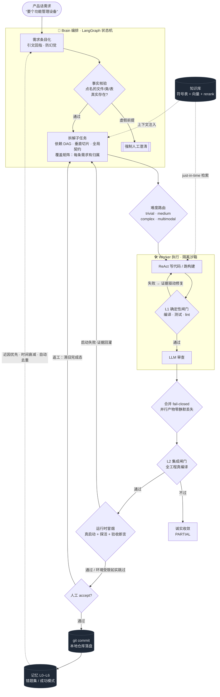
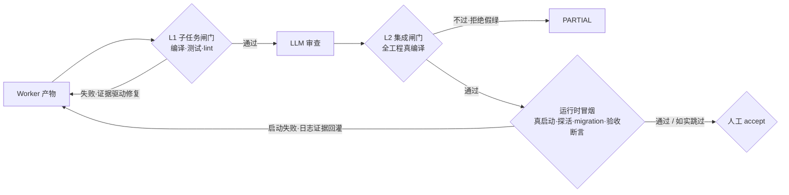
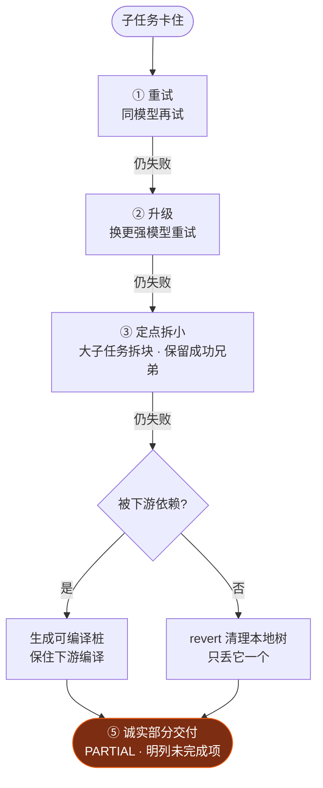
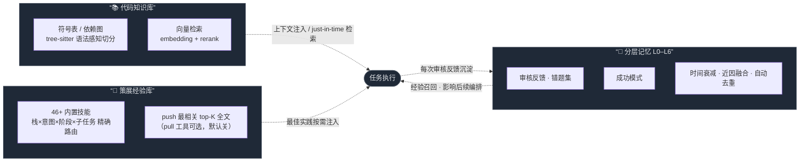

<div align="center">

# 🐝 Swarm

**简体中文** | [English](./README_EN.md)

### 对交付结果负责的多智能体工程系统

*不是又一个 AI 编程助手 —— 而是一支接过完整需求、自主拆解执行、跑完全部验证再交还给你的工程团队。*

<br/>

[](https://github.com/Victzhang79/Swarm/actions/workflows/ci.yml)
[](LICENSE)
[](https://www.python.org/)
[](https://github.com/langchain-ai/langgraph)
[](#-系统自身如何被验证)
[](https://github.com/Victzhang79/Swarm/releases)
[](#)

<br/>

**产品话需求进 · 生产级产物出 · 每一步可追溯 · 每一分钱可审计**

[💡 为什么](#-为什么需要-swarm) ·
[🎬 30 秒看懂](#-30-秒看懂) ·
[🔄 工作原理](#-工作原理) ·
[🧭 设计原则](#-五条设计原则) ·
[🧬 核心机制](#-核心机制) ·
[🛡️ 安全模型](#️-安全模型) ·
[📈 可观测](#-可观测与运维探针) ·
[🚀 快速开始](#-快速开始) ·
[🏗️ 架构](#️-架构一览)

</div>

---

## 💡 为什么需要 Swarm

大模型很会写代码 —— 但**也很会自信地交付错的东西**。

在"满地都是编程智能体"的今天，瓶颈早已不是"让 AI 写出代码"，而是：

> **怎么让一群自主的 AI，在没人盯着时，把活干对、干完、不超预算，且每一步可追溯？**

Swarm 是我们对这个问题的完整回答：把一个产品化需求交给一套**有分工、有验证、有预算、有记忆**的智能体团队 —— 大模型只做规划与裁决，大量并行执行交给小模型，而"交付物是否可信"从不依赖任何一个模型的自我评价，只依赖**确定性证据**。

| | 🧑‍✈️ 副驾式助手<br/>(Cursor / Copilot / Claude Code) | 🐝 Swarm |
|---|---|---|
| **协作形态** | 坐你旁边帮你写，你逐行把关 | 接过整个需求，自己拆解执行、跑完验证再交还 |
| **优化目标** | 单人手速 | **无人值守下的交付可信度** |
| **需求兑现** | 你自己核对做没做全 | **需求条目化 + 覆盖矩阵 + 可执行验收断言**，每一条需求的下落都有账 |
| **验证方式** | 你来判断对不对 | **确定性闸门**（编译/测试/lint/真启动/接口断言）先卡，再 LLM 审查，最后人工 accept |
| **失败处理** | 你接手救场 | **逐级恢复阶梯** + 诚实部分交付，绝不推倒已成功的工作 |
| **成本控制** | 用多少算多少 | **任务级预算账本**：预留-结算、超支确定性熔断、费用可审计 |
| **越用越懂你** | 每次从零开始 | **分层记忆 + 策展经验库**沉淀每次反馈，越用越懂你的项目 |

> 智能体越自主，"可信交付"这一层就越不可或缺 —— 这正是 Swarm 全部工程投入的地方。

---

## 🎬 30 秒看懂

**一句话产品需求 → 全栈模块端到端跑通、编译通过、可运行、逐条需求可对账。**

```
你：            "想要个功能管理设备"
                        │
  Brain 把需求结构化成带原文引文的条目清单（防幻觉需求）
                        │
  翻译成文件级技术设计 → 依赖 DAG · 垂直切片 · 全局契约
                        ▼
┌──────────────── 系统自主产出 ────────────────┐
│  📄 Device.java              (实体)            │
│  📄 DeviceMapper.java + .xml (持久层)          │
│  📄 DeviceService(+Impl).java(业务层)          │
│  📄 DeviceController.java    (接口层)          │
│  📄 device.html / device.js  (前端)            │
│  🗄️ sys_device               (建表 SQL)        │
└───────────────────────────────────────────────┘
   ✅ L1 编译通过  ✅ L2 集成编译  ✅ 真启动探活  ✅ 接口断言逐条执行
```

多数情况无需你点名改哪个文件或逐行审查 —— 你描述"要什么"，Swarm 负责"怎么对地做出来"，并在人工审核面板上给你一份**完整的对账单**：哪些需求由哪些改动覆盖、哪些接口断言真实通过、哪些项因环境受限如实标记为需人工确认。

> 上面演示的是 Java 单体项目；**同一套编排对 Go / Rust / TypeScript / Python / Vue 前后端分离项目同样成立**——
> 技术栈由磁盘探测权威判定（不信文档自述），分层规范、构建命令、验收标准、确定性修复工具链全部随栈切换，
> 规划逻辑中不写死任何单一栈或示例项目。

---

## 🔄 工作原理

一个需求从进入到落盘，流经 **Brain 编排 → 难度路由 → Worker 沙箱执行 → 三层验证 → 记忆闭环**：



---

## 🧭 五条设计原则

Swarm 的可信度不来自"换个更强的模型"，而来自贯穿全系统的五条工程原则。理解了它们，就理解了下面每一个机制为什么长这样：

1. **确定性裁决，LLM 建议**。能不能交付，由编译器、测试、真实 HTTP 应答这类确定性证据裁决；LLM 的意见（审查、评分、自评）只作建议，永远无权放行。
2. **Fail-closed 默认拒绝**。工具跑不了绝不当"验证通过"；解析失败按未扫处理；安全与正确性状态缺省判否。宁可诚实报部分交付，绝不静默假绿。
3. **账实一致**。每一条需求、每一个子任务、每一次模型调用、每一分钱 token，都有账可查：需求覆盖矩阵、进度三本账（完成/放弃/剩余）、任务级预算账本、降级原因机读汇总。
4. **单调收敛**。覆盖集与完成集只增不减（有回归即 fail-loud）；重规划做增量修补而非全量重拆；失败走有界恢复阶梯，绝不推倒已成功的工作、绝不无界重试。
5. **降级必可观测**。任何跳过、截断、回退、放弃都留下结构化痕迹并进入终态报告——"没验证"与"验证通过"在数据上永远可区分。

---

## 🧬 核心机制

### 📋 需求即合同：从"大概做了"到"逐条有账"

传统 AI 编码的第一个失真点发生在最上游：模型读了需求文档，然后"凭理解"开工——做没做全、做的是不是文档里写的，无人对账。Swarm 把需求变成**可执行的合同**：

- **需求条目化 + 引文回指**：PRD 先被结构化为条目清单，每一条必须**逐字回指原文引文**并通过确定性校验——模型幻觉出来的"需求"进不了清单；抽取质量有轮级闸门（条目数与文档规模明显不符即带反馈重抽，好轮次绝不被坏轮次覆盖）。
- **覆盖矩阵**：计划期每个子任务显式声明覆盖哪些条目；未覆盖的需求会**拒绝计划并回灌重规划**（有界）；小缺口在给足修补机会后可降级放行，但残差全程可见、直达人工审核面板。
- **存量能力申报**：棕地项目的 PRD 常描述基线已有的能力——计划可申报"该需求现有代码已满足"（必须给依据），申报是承诺：可自动验证的条目会在冒烟阶段真执行断言核查，核不了的如实降级并呈现给人工否决。
- **可执行验收断言**：需求条目再生成 HTTP 黑盒断言（如 `POST /api/device → 201`），对**真实启动的应用**逐条执行；需要登录态的接口自动在冒烟内取 token 执行鉴权断言——登录基础设施失败时如实判"无法定论"而不冤枉代码。
- **事实核验前置**：规划前先核对需求点名的文件/类/表在**工作区磁盘与 git 跟踪**两个 ground truth 里是否真实存在——虚假前提强制转人工澄清，而不是硬着头皮跑。

### 🧠 编排与并行：像一个真正的工程团队那样分工

- **产品话即可**：只描述"要什么功能"——系统先把模糊需求翻译成文件级技术方案，再规划执行。
- **垂直切片 + 真实依赖 DAG**：一个跨多文件的完整功能作为一个子任务交付（而非按文件拆碎）；批次间只按**真实模块依赖**连边，剥离 LLM 误加的人造串行链，让真正独立的工作满并行。
- **全局共享契约**：多模块并行前先产出跨模块接口/DTO/API 契约注入每个 Worker，确保并行产物接口对得上；契约按 `(模块, 接口名)` 精确归并，跨模块同名接口不会被错误合体。
- **写集级模块互斥**：并发任务按**全部写入路径**的顶层模块组合加锁——写集重叠必互斥、不相交照常并行；锁升级冲突有界排队，绝不"纸面互斥"带病并发。
- **超大型需求分批拆解**：上百文件按功能模块分批推进（逐批可见进度），批处理与单发共用同一套覆盖与验证纪律。

### ✅ 三层验证：每一层都要真凭实据



- **L1 子任务闸门**：产物先过编译/测试/lint 硬闸，修复轮由真实编译证据驱动；返工清空旧完成态，防"提前宣告完成"。语义正确性零覆盖的产物（有代码但无任何测试/验证命令）被显式标记进人工审核视野。
- **L2 集成闸门**：对全工程做真编译（Java 多模块 reactor / 各栈对应构建）；工具链缺失时**拒绝放行而非静默跳过**；契约完整性检查按缺失率有牙裁决，缺失符号**逐个词边界归因**到责任子任务定向重派（归因不出回退全员，绝不漏修）。
- **运行时冒烟 + 验收**：编译通过不等于跑得起来——在沙箱**真启动应用**（manifest 证据推导启动命令与端口，多栈对称）、TCP/HTTP 探活、数据库 migration 执行验证，然后逐条执行验收断言。启动失败按证据三分类：代码错误回灌定向修复；环境缺失如实跳过绝不冤枉代码；分类不明保守跳过。
- **人工闸**：审核面板呈现完整对账单——覆盖矩阵、逐条断言结果、冒烟/migration 结论、基线申报清单、需人工复核项、全部降级原因。人是最后一道闸，且拿到的是**全部事实**而非模型的自我总结。

### 🔀 合并 fail-closed：并行的产物一行代码都不许静默消失

并行智能体系统最隐蔽的失真点在合并：几十个 Worker 的 diff 收拢成一个交付物时，任何"悄悄丢弃"都意味着跑完也白跑。Swarm 把合并的每条丢失路径逐一封死：

- **新文件多写者**不一致时，落选方进入 rebase 通道重生成——且重派时注入**保留方的最新内容**，打破"在旧基线上重生成同样冲突"的死循环；
- **3-way 合并前校验基线**：hunk 上下文与实际文件不符（基线漂移）立即拒绝，绝不产出语义损坏的"干净"合并；
- **硬冲突标记**（`<<<<<<<`）绝不混入交付 diff——冲突渲染单独落诊断件；
- **rebase 超限按来源分流**：真源码被丢必须升级人工，绝不静默交付；
- **每一次剔除都进账**：被放弃的子任务并入放弃清单、终态诚实标 `PARTIAL` 并明列，绝不假 `DONE`。

### 🪜 失败恢复：逐级消化，绝不推倒重来



恢复阶梯之下，还有一整套**中止与恢复协议**兜住系统级意外：

- **重试不从零开始**：任务重试会播种上一轮已通过验证的产物与需求覆盖水位——已经做对的部分直接继承，重试成本大幅下降；
- **独立看门狗**：墙钟与锁续期由独立时钟驱动的看门狗守护，任何一个节点内部悬挂都不再意味着保护失效；
- **终态写有 CAS 守卫**：晚到的后台写永远无法把已取消的任务"复活"成活跃态；
- **资源类中止统一走 PARTIAL 抢救**：墙钟耗尽、锁丢失、token 超限——一律先抢救已完成产物再收敛终态，绝不裸 FAILED 丢掉几小时的工作；
- **基础设施自愈**：PG checkpointer 连接池探活重建、周期孤儿对账、沙箱模板失效自动改用真实可用镜像。

### 💰 成本与弹性：每一分钱有账，每一次卡顿有解

- **任务级预算账本（TaskLedger）**：所有模型调用经单点闸预留-结算，**错误路径同样入账**（超时/取消的已烧 token 不再失明）；账本落库、跨重启延续；所有重试层统一从账本扣减——饱和的供应商再也不能把一个任务烧成无底洞，超支确定性熔断并抢救部分交付。
- **供应商弹性**：进程级熔断 + 半开恢复；主模型停滞自动切备（流式看门狗按 chunk 间隔判停滞，活跃流不误杀）；provider 级并发闸防打爆限流；每个 Worker 模型带多级 fallback 链。
- **思维链失控无损自愈**：云端 reasoning 模型会在思维链里原地打转——它一直在吐 chunk，停滞看门狗判“健康”，`max_tokens` 又只封最终答案（reasoning 内容豁免），实测单次调用烧 25 分钟仍不收尾。抓手是一个事实：**正文吐出第一个字之前，中途 abort 是无损的**（下游一个 chunk 都没收到）→ 思考阶段超预算即中止，**先换一个不失控的模型重跑（推理能力完整保留）**；只有在整条 fallback 链都用尽时，才退而求其次关闭 thinking 重开流。顺序不能反：实测关掉思考虽能救活流程，却会**漏掉需求**（同一份 PRD：106 条 → 92 条，整块功能消失），交付基准被悄悄降级。
- **弹性墙钟**：执行段墙钟随任务规模自动放宽（基线 + 每子任务增量），大型任务不被误杀，失控任务有上限。
- **小模型胜任性**：Worker 侧默认本地小模型并行——ReAct 历史按预算裁剪、文件局部读取、scope 精确收窄、工具面按需裁剪、时间预算贯穿每个验证阶段，小模型也能稳定长跑。

### 📚 知识库 + 记忆 + 经验：越用越懂你



- **代码知识库**：符号表 + 向量检索（embedding + rerank，可配云端或自建），为每个任务精准注入相关代码；Worker 还可即时检索。多语言语法感知切分 + 多源资料采集（PDF/Word/HTML/图片）。
- **分层记忆 L0–L6**：每次审核反馈沉淀为记忆，影响后续编排与生成。时间感知衰减让旧案例自动淡出、新鲜教训优先；近因融合排序 + cross-encoder 精排提升召回精度；碎片自动整合，库越用越干净。
- **经验拔插层**：一个 `.md` 即一个技能，零代码热插拔。选择器按**栈×意图×阶段×子任务内容**精确路由：既看工程画像（框架级相关性判别——FastAPI 项目绝不会被推 Django 建议，Gradle 工程绝不会被推 Maven 经验；数据库依赖探测——探出 MySQL 才挂 MySQL 经验），也看**这个子任务到底在写什么**（写 pom 的拿构建经验、写 Mapper 的拿持久化经验、写认证的拿安全经验），同时保留本栈通用编码规范。最相关的 top-K 条经验全文直接进提示词（实测小模型对"按需工具自取"零采用，故 pull 工具默认关闭、可开关回退）。系统级编写/导入（WebUI 管理），每次入库过严格准入闸（schema/密钥扫描/提示注入拦截/标题-正文意图一致性裁判），保存前可**预览挂载面**——这条技能会出现在哪些项目的哪些任务里，一目了然。经验永远是建议（advisory），无权跳过任何确定性闸门。

### 🌐 多技术栈：不是"支持 Java 顺带其它"，而是栈无关设计

| 能力层 | 覆盖 | 机制 |
|---|---|---|
| 栈探测 | Java/Go/Rust/TS·JS/Python/Vue 混编 | 磁盘 manifest 权威定栈（pom/gradle/go.mod/Cargo.toml/package.json/pyproject），不信需求文档自述；并探测数据库依赖面 |
| 构建/验收 | 按栈自动 | `mvn`/`gradle`/`go build`/`cargo build`/`npm build`/py_compile；验收命令随 harness 走，不写死任何栈 |
| Lint | 5 语言 | checkstyle / go vet / clippy / eslint / ruff（工具故障≠代码错误，基础设施瞬时故障单独识别） |
| 确定性修复 | Java/Go/Rust/TS | 按生态委托事实标准工具：Java import/依赖自证、`goimports`、`cargo fix`、`eslint --fix` |
| 依赖补全 | 多栈 driver 化 | 从**项目自身兄弟 manifest** 找权威坐标注入（只用自证坐标、绝不臆造、fail-closed）；新栈=注册一个 driver |
| 依赖坐标合法性闸 | Java/Maven（可推广） | 构建**之前**扫全树 manifest：每条依赖必须是【本工程模块 / 父级受管 / 仓库真实存在】三者之一，否则**可证永不可解析** → 确定性改回或剪除。**不解析构建工具的报错文本**（那是打地鼠，换个错法就漏一个），只校验坐标状态；仓库不可达则一律放行（fail-open，宁可漏判绝不误剪）。为什么必须前置：坏坐标是**解析期**崩塌，会连坐整棵 reactor，让每个 Worker 的构建闸都误报“错在上游” |
| 分层模板 | Java/Vue/TS/Go/Python | 新建文件按栈找同类既有文件做范例注入，免全项目探索空烧预算 |
| 规划去特化 | 全部 | 分组/拆分/prompt 中无任何项目专名或单栈写死（有回归测试锁定不得回流） |

<details>
<summary><b>🔧 展开：更多确定性加固机制</b></summary>

<br/>

- **栈权威 + 机械错误确定性自修**：技术栈由磁盘探测权威定栈并注入每个 Worker（如"本项目用 `jakarta` 不用 `javax`"）。探测还钉死项目真实存在的基建符号（缓存/响应/鉴权/基类的真实 FQN）——小模型只能复用项目真有的类，禁止臆造"标准类"。万一仍写错，L1 不靠换模型，而是按生态委托事实标准工具确定性修复后重跑构建确认；缺依赖据自身 pom 补全、错版本号查仓库真实版本校正。对确实无法自修的臆造，确定性识别并硬失败该子任务，不再空耗重试。
- **模型不可用自动降级**：每个 Worker 模型带多级 fallback 链，某模型被推理端点中途下线时自动逐级切换，不让单模型抖动拖垮整轮。
- **跨子任务文件同步免空转**：消费方读一个尚未由其它子任务建出的文件时，按文件名在工程树自动定位；确实未落地的给明确止转信号，靠集成期 BLOCKED 退避自然消解。
- **共享契约并集合并**：多模块契约按方法/字段并集合并而非"保留首版丢弃其余"，杜绝"被丢版独有方法缺失→下游找不到方法"。
- **聚合文件不互相覆盖**：多个子任务并行改同一聚合清单（根 `pom.xml`/`settings.gradle`/`Cargo.toml`/`go.work`）时，同锚点按并集收拢，任何一方的登记都不会丢。
- **工作量不超执行预算**：派发前保证每个子任务文件数不超上界，超界先按实体/分层拆小再进 Worker；超时的第一恢复动作是拆小而非换模型硬磨。
- **系统性 fail-closed 加固**：默认拒绝、数据先写后删、临时验证回滚仅限改动涉及文件（绝不整库 `clean -fd` 抹用户改动）、读路径 workspace 边界复校、跨项目资源按归属鉴权。
- **大型多模块工程交付韧性**：根 pom 写权收敛唯一属主、内部模块依赖版本完整性闸门、未注册模块 fail-closed、按文件独立落盘（单个坏补丁不连坐清零几十个正确产物）。

</details>

---

## 🔬 系统自身如何被验证

一个替你交付代码的系统，自己的代码必须经得起同样的标准。这也是我们最愿意展示的部分——**Swarm 的工程方法论本身就是产品的一部分**：

- **3800+ 行为测试**在全新空 PostgreSQL + Python 3.12 的 CI 上全量跑，每个 commit 必绿才合入。测试写**行为断言**而非结构断言——不焊死实现，重构不脆；修 bug 先写红的复现测试（test-first），语义演进时旧测试按拍板显式更新并标注机制编号，绝不悄悄迁就。
- **每个修复批次经对抗性双复核**：独立的 code-reviewer 与 silent-failure-hunter 从相反方向审查——前者验证声称的修复真的成立，后者专门狩猎吞异常、坏回退、写了没人读的死键、"配置了但从未生效"。复核点名七类盲区（锁键一致性、全调用点、丢工作信号入终态、探针瞬时性、线程拓扑、粘滞键生命周期、fail-open 对称性），抓到的问题当批全部整改。
- **配置面冻结有牙**：全部 200+ 环境开关登记为单一事实源，新增开关不登记则 CI 直接红——"每轮跑的是从未整体验证的配置组合"这类隐患被制度性消除；随附 dev/e2e/prod 三套冻结的推荐组合。
- **状态通道 schema 一致性有守卫**：编排框架对未声明的状态键会静默丢弃（实证过），因此"节点写的每个键必须在 schema 声明"由测试强制——杜绝写了没人收到的死功能。
- **fail-closed 是默认哲学**：安全/正确性状态缺省判否、工具跑不了绝不当"验证通过"、降级必可观测、解析失败按未扫处理——宁可诚实报 PARTIAL，不静默假绿。

---

## 🛡️ 安全模型

面向**内网多用户**部署形态设计，每一层都有明确的信任边界：

| 层 | 机制 |
|---|---|
| **认证/授权** | 多用户 Token + RBAC（全局角色 + 项目级成员权限）；首次登录强制改密；Token 存库为 SHA256 at-rest 哈希、登录轮换（明文不落库）；`SWARM_TOKEN_TTL_HOURS` 可选限令牌暴露窗口（默认 0=永不过期，需显式配置；生产模式仅告警不阻断） |
| **浏览器会话** | 浏览器主路径优先 **HttpOnly Cookie**，HTTP 不再走 `?token=` URL（避免日志/Referer 泄漏）；程序化客户端走 `Authorization` Header；WebSocket 仍保留 `?token=` 最弱兜底。失权即断流，不静默重连 |
| **API 面收权** | `/api/status` 等暴露基建拓扑的端点需鉴权；`/docs` `/openapi.json` 生产环境默认纳入鉴权（`SWARM_DOCS_PUBLIC` 双向覆盖，配置异常 fail-closed 拒绝而非 500） |
| **命令执行** | Worker 沙箱命令过 **hardened 黑名单**（规则库存 DB 可管理，加载异常回退内置基线绝不放行 `rm -rf /` 类）；所有承载 agent 命令的路径统一过闸 |
| **执行隔离** | 沙箱执行隔离由 CubeSandbox 提供（非 root/网络策略/资源限额取决于远端沙箱与模板配置）；主机与目标项目工作区经路径边界校验，防穿越 |
| **密钥管理** | LLM Key 等经 `secret_store` 加密落库；提交/日志有敏感信息扫描纪律；交付 diff 过密钥泄漏扫描（检出 CRITICAL 级密钥阻断交付升级人工） |
| **生产门禁** | `SWARM_ENV=production` 启动自检：弱根密钥/默认口令/弱 DB 凭据/未开 RBAC → 拒绝启动；运行期热更新改出不安全配置 → 原子回滚拒绝落盘 |
| **注入面治理** | 关键路径 shell 拼接经 `shlex.quote`；上传/摄取路径有 SSRF/穿越校验；LFI 信任边界设在任务入口；经验技能入库过提示注入与危险指令拦截 |

---

## 📈 可观测与运维探针

| 端点 | 用途 | 语义 |
|---|---|---|
| `GET /api/health` | 存活探针 | 匿名可达，无组件细节（不泄露拓扑） |
| `GET /api/health/ready` | 就绪探针（容器 HEALTHCHECK/编排门） | fail-closed 真探活：PG 必查、Redis 按启用判、Qdrant 含本地模式兜底；任一启用依赖不可达 → 503。RBAC 开启时匿名只回状态位，明细归鉴权的 `/api/status` |
| `GET /api/status` | 组件面板（需鉴权） | 8 组件真实连通性检测，探活与 `/ready` 同一实现（无双源漂移） |
| `GET /api/metrics` | 指标 | 任务/沙箱/模型调用计量 |
| `GET /api/observability/*` | 延迟/慢查/时间序列 | 模型调用与关键路径观测 |
| 任务终态报告 | `degraded_summary` 机读汇总 | 该轮降级了什么、各多少次——按机制聚合一眼判读，明细全量保留供人工审读 |
| 任务/沙箱日志 | `swarm.log` + 每沙箱 JSONL | 全链路可追溯（每次 LLM 调用、每条沙箱命令、每个闸门判定） |

运维配套：启动对账 + 周期孤儿对账（任务四层状态一致性恢复）、看守进程（停滞任务检测）、审计事件（命令拦截/交付决策落库）、任务级 token 账本可审计、E2E 全流程脚本组（环境自检/基线清理/浸泡探测/三路盯守，见 `scripts/e2e_*`）。

---

## 📦 环境依赖

### Swarm 自身运行依赖

| 依赖 | 版本 | 必需 | 说明 |
|---|---|:---:|---|
| Python | ≥ 3.11 | ✅ | 推荐 3.12 |
| PostgreSQL | 16 + [pgvector](https://github.com/pgvector/pgvector) | ✅ | 任务/项目/记忆/向量元数据 |
| [Qdrant](https://qdrant.tech/) | ≥ 1.13 | ✅ | 代码向量库；setup.sh 自动下载本地二进制或用 Docker |
| LLM 接入点 | OpenAI 兼容 API | ✅ | 至少配一个（云端 key 或本地推理服务） |
| [CodeGraph CLI](https://github.com/colbymchenry/codegraph) | latest | ⬜ | 构建符号表/依赖图；缺失则跳过该阶段，不影响主链路 |
| CubeSandbox / E2B | — | ⬜ | 隔离沙箱执行；留空则 Worker 本地执行 |
| Embedding / Rerank 服务 | OpenAI 兼容 | ⬜ | 云端（SiliconFlow 等）或自建；缺失回退内置 fastembed |
| [Redis](https://redis.io/) | ≥ 6 | 生产推荐 | 跨进程模块锁 · 任务队列跨重启存活 · 长跑锁续期保护；单机试用可不装 |
| [Docker](https://docs.docker.com/) + Compose v2 | — | ⬜ | 用 Docker 一键拉起时需要；裸机部署不需要 |

**操作系统**：macOS（Apple Silicon）/ Ubuntu 22.04+ / Debian / RHEL 系（setup.sh 自动适配 brew / apt / dnf）。

> **运行拓扑**：目标部署形态为 **单进程 + PostgreSQL + Redis**。PostgreSQL 持久化任务/项目/记忆并作为
> LangGraph checkpoint 存储；Redis（生产推荐）提供跨进程模块互斥、任务队列的跨重启存活与自愈补漏、
> 以及长跑任务的锁续期保护。**Redis 的启用开关是 `SWARM_REDIS_ENABLED=true`**（仅填连接串不算启用；
> 未启用时系统安全降级为进程内实现，适合单机试用但不具备上述跨进程/跨重启保障）。生产另建议
> `SWARM_REQUIRE_PG_CHECKPOINTER=1` 强制 PG checkpointer，确保重启后人工审核/澄清等中断态可续跑。
> 推荐配置组合见 `config/profiles/{dev,e2e,prod}.env`。

### ⚠️ 目标项目的技术栈工具链（重要）

Swarm 的 L1/L2 闸门会**真实编译目标项目**——因此运行编译的环境必须装好目标项目所属技术栈的工具链。按磁盘探测到的栈自动选择构建方式：

| 目标项目技术栈 | 需要的工具链 | 构建方式 |
|---|---|---|
| Java | JDK（版本需与目标项目匹配，如 JDK 17）+ Maven / Gradle | `mvn` / `gradle` |
| Go | Go toolchain | `go build` / `go vet` |
| Rust | Rust + Cargo | `cargo build` |
| JavaScript / TypeScript | Node.js + npm / pnpm / yarn | `npm run build` 等 |
| Python | Python + pip | 语法/导入校验 |

工具链落在哪，取决于 Worker 在哪执行编译：

- **配了隔离沙箱（推荐 / 生产）** → 沙箱镜像按探测到的栈与版本自动烤入对应工具链。运行 Swarm 的主机无需装目标栈工具链——沙箱按项目自适应。这是支持"一台机器跨多技术栈交付"的正确方式。
- **未配沙箱（Worker 本地执行）** → 运行 Swarm 的主机/容器必须自行装好目标项目栈的工具链（且 Java 版本要对得上），否则 L1/L2 编译闸门无法验证、会诚实判 `PARTIAL` 而非假绿放行。

> 💡 **一句话**：想让一台机器可信地交付任意技术栈的项目 —— 配隔离沙箱，让镜像按项目自适应工具链。

---

## 🚀 快速开始

### 方式一：Docker 一键拉起（最快，推荐试用）

```bash
git clone https://github.com/Victzhang79/Swarm.git
cd Swarm/swarm                   # 项目根在内层 swarm/ 目录
cp .env.docker.example .env      # 按需填 LLM Key 等（不填也能起，登录后在 WebUI 配）
docker compose up -d --build     # 拉起 postgres + qdrant + swarm 三容器
```

启动后访问 **http://localhost:8420**（默认登录 `admin` / `swarm`，首次强制改密）。启动钩子自动建表。

> Docker 化的是 **Swarm 自身**；**CubeSandbox（远程沙箱）是独立服务**，不在 compose 内，Worker 通过 `SWARM_SANDBOX_*` 连它，留空则本地执行。

### 方式二：一键安装脚本（裸机）

```bash
git clone https://github.com/Victzhang79/Swarm.git
cd Swarm/swarm
bash setup.sh           # 9 步全自动：系统依赖→pgvector→PG→venv→依赖→建表→CodeGraph→.env→Qdrant→启动
```

常用选项：`--skip-pg`（已有 PG）· `--skip-codegraph` · `--skip-env` · `--dev`（装开发依赖+冒烟）· `--help`。

### 方式三：手动安装

```bash
createdb swarm && psql -d swarm -c "CREATE EXTENSION IF NOT EXISTS vector;"  # 1. PG16 + pgvector
python3.12 -m venv .venv && source .venv/bin/activate && pip install -e .    # 2. venv + 依赖
cp .env.example .env             # 3. 配置（填 API Key / DB URI）
python scripts/init_db.py        # 4. 建表
bash scripts/start-services.sh   # 5. 启动 Qdrant + API
```

验证：`curl http://localhost:8420/api/health` · 浏览器开 `http://localhost:8420`。

---

## 🏗️ 架构一览

| 模块 | 目录 | 职责 |
|---|---|---|
| API + Web UI | `api/` | FastAPI 服务 + 静态前端 |
| **Brain** | `brain/` | LangGraph 编排状态机（需求转化 · 拆解 · 派发 · 合并 · 验证） |
| **Worker** | `worker/` | ReAct Agent · L1 确定性验证 · 沙箱构建 |
| 知识库 | `knowledge/` | 检索 · embedding · rerank · 增量调度 |
| 记忆 | `memory/` | L0–L6 分层记忆 · 时间感知衰减 · 去重整合 |
| 经验层 | `experience/` | 策展技能库 · 栈×意图×阶段路由 · push top-K 全文注入（pull 可选） |
| 项目 | `project/` | PG 存储 · 预处理 · diff 应用 · 沙箱推断 |
| 基础设施 | `infra/` | 协调原语 · 调度选主 · 沙箱池 · checkpoint GC |
| 模型 | `models/` | 多接入点路由 · 预算账本 · 熔断器 |
| 配置 | `config/` | pydantic-settings · 密钥加密存储 · 环境开关登记册 |
| CLI | `cli/` | Click 命令行 |

**端口**：Swarm API + Web UI `8420` · Qdrant `6333/6334` · PostgreSQL `5432` · Redis `6379`（默认关闭）。

---

## 🧭 日常运维

| 命令 | 作用 |
|---|---|
| `docker compose up -d` / `down` | Docker：拉起 / 停止全栈（`down -v` 清数据卷） |
| `bash setup.sh` | 裸机一键安装 + 启动（首次） |
| `bash scripts/start-services.sh` | 启动 Qdrant + API（日常） |
| `bash scripts/restart-api.sh` / `stop-api.sh` | 重载 / 停止 API |
| `bash test/run_all.sh` | 运行全部测试 |
| `swarm submit -p <project_id> --watch` | CLI 提交任务并跟踪 |

### 🖥️ CLI 命令一览

CLI 全走 HTTP、自动带 token（`swarm login` 后各命令复用 `~/.swarm/cli_token`），可端到端管理项目/任务/知识库/成员：

| 组 | 命令 |
|---|---|
| 认证 | `swarm login` |
| 项目 | `swarm project list / create / show / delete / stats` |
| 预处理 | `swarm preprocess run <pid>` · `swarm preprocess status <pid>` |
| 任务 | `swarm submit` · `swarm task list -p <pid>` · `swarm task approve/revise/reject/cancel/retry/apply-diff` |
| 知识库 | `swarm kb overview/symbols/norms` · `swarm kb retrieve "<query>" -p <pid>` |
| 成员/RBAC | `swarm user list` · `swarm member list/add/remove -p <pid>` |
| 运维 | `swarm status` · `swarm config show/models/routing` · `swarm sandbox list/create/destroy` · `swarm check` |

> 每个命令 `--help` 看参数；RBAC 开启时未登录会提示 `swarm login`。

---

## ⚙️ 配置

`.env`（`SWARM_*` 前缀）与 Web UI「设置」面板双轨管理，保存即生效（热重载）：

- **模型接入点**：多个 OpenAI 兼容接入点（云端 / 本地），Brain 与 Worker 各层自由选模型 + 多级兜底链。
- **Embedding / Rerank**：云端（SiliconFlow / OpenAI / Cohere）或自建；敏感 Key 经 `secret_store` 加密存储。
- **沙箱**：CubeSandbox 接入信息，支持项目级定制模板（按栈自适应工具链）。
- **配置面登记册**：全部 `SWARM_*` 开关在 `config/env_registry.py` 有单一事实源（含出处指针），新增开关必须登记（测试强制）；`config/profiles/` 提供 dev/e2e/prod 三套冻结的推荐组合。

完整变量见 [`.env.example`](.env.example)。

---

## ❓ 常见问题

- **预处理 index 阶段被跳过？** 未装 CodeGraph CLI，不影响主链路；需符号表检索则装 CodeGraph。
- **预处理跳过向量嵌入？** Qdrant 未启动，查 `curl http://localhost:6333/collections` 或重跑 `start-services.sh`。
- **模型下拉显示「配置 API Key」？** 接入点未配 Key/不可达，在「设置 → 模型接入点」填 Key 并刷新。
- **Worker 代码在哪执行？** 未配 CubeSandbox 时本地执行（主机须自备目标栈工具链）；生产建议配隔离沙箱（镜像按栈自适应）。
- **L2 集成编译一直不过 / 任务收敛成 PARTIAL？** 多为运行编译的环境缺目标项目栈工具链（或 Java 版本不匹配）——见「📦 环境依赖 → ⚠️ 目标项目的技术栈工具链」。
- **生产环境想匿名访问 `/docs` / `/openapi.json`？** 生产默认把 API 文档端点纳入鉴权；确需公开设 `SWARM_DOCS_PUBLIC=true`。
- **`SWARM_ENV=production` 启动即报「安全自检失败」退出？** 生产模式 fail-closed 门禁：必须显式设 `SWARM_SECRET_KEY`（高熵根密钥）、`SWARM_BOOTSTRAP_ADMIN_PASSWORD`（非默认）、开启 RBAC、DB 不得用公开默认弱凭据。按报错逐项设好即可；运行期热更新改出不安全配置同样被拒绝并原子回滚。
- **启动即报 `多 worker` 错误退出？** 当前为单进程架构，检测到 `WEB_CONCURRENCY>1` 会硬拦拒绝启动（防多 worker 下推送/调度静默错乱）。平台默认值误伤时设 `SWARM_ALLOW_MULTIPROCESS=1` 降级为告警。
- **任务会不会因为墙钟超时被中止？大型任务安全吗？** 弹性预算：有效上限 = 基线 + 每子任务额外时长，随任务规模自动放宽（默认 6h + 20min/子任务），不会误杀合法大型任务。`SWARM_TASK_DEADLINE_S` / `SWARM_TASK_DEADLINE_PER_SUBTASK_S` 可调。
- **端口 8420 被占用？** `export SWARM_PORT=<port>` 后重启。
- **数据库连不上？** 确认 PG16 启动、`swarm` 库存在、pgvector 已启用、`SWARM_DB_POSTGRES_URI` 正确，再 `python scripts/init_db.py`。
- **重启后卡在「计划确认 / 结果审核」的任务点「通过」没反应？** 人工闸态靠 Postgres checkpointer 保存续跑点。开发环境默认内存 checkpointer，重启即丢（只能 cancel 重发）；生产默认强制 PG checkpointer（`SWARM_REQUIRE_PG_CHECKPOINTER`），重启后可正常 resume。

---

## 🧪 测试

```bash
bash test/run_all.sh                                    # 全部测试
.venv/bin/python -m pytest test/ -q                     # 等价命令
.venv/bin/ruff check . --select E9,F63,F7,F82           # 关键 lint（CI 同款）
```

CI 在全新空 PostgreSQL（pgvector）+ Python 3.12 环境下运行 lint 与全量测试（当前 **3800+ passed**）；
另有 Docker Smoke 工作流对 compose 三容器栈做端到端冒烟。测试纪律：**行为断言优先**（不焊死实现结构）、
修 bug 先写红的复现测试、每批改动过独立对抗双复核（code-reviewer + silent-failure-hunter）。

---

<div align="center">

## 📄 License

[MIT](LICENSE) · 用 🐝 与确定性闸门构建

</div>
