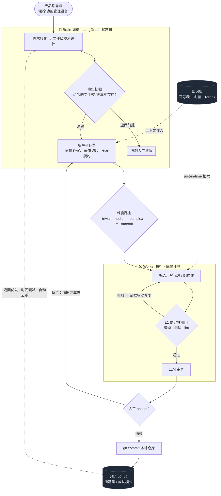

# 🐝 Swarm

> 不是又一个 AI 编程助手 —— 而是一套**对交付结果负责**的多智能体工程系统。

大模型很会写代码，但**也很会自信地交付错的东西**。在"满地都是编程智能体"的今天，瓶颈早已不是"让 AI 写出代码"，而是**怎么让一群自主的 AI 在没人盯着时，把活干对、干完、且每一步可追溯**。

Swarm 把一个需求交给一套**有分工、有验证、有记忆**的智能体团队：**Brain** 理解需求、做技术设计、拆解子任务；**Worker** 在隔离沙箱里写代码、跑构建、自我验证；**确定性闸门**在 LLM 自评之前先用编译/测试/lint 卡一道硬标准；**记忆系统**把每次审核反馈沉淀下来，让系统越用越懂你的项目。

> **和 Cursor / Copilot / Claude Code 的区别**：它们是"坐你旁边帮你写"的副驾，由你逐行把关，优化的是**单人手速**；Swarm 是"接过整个需求、自己拆解执行、跑完验证再交还给你"的工程班子，优化的是**无人值守下的交付可信度**——智能体越自主，这一层越不可或缺。

---

## 🔄 它是怎么干活的



**一句话需求 → 8 文件全栈模块端到端跑通**：已验证"想要个功能管理设备"一句话 → 系统自主设计并产出 实体/Mapper/Service/Controller + 前端 + 建表，编译通过、可运行。

---

## ✨ 亮点

### 🔒 可信交付：不把"模型说它对了"当成"它真的对了"
- **确定性闸门优先**：Worker 产物先过 L1 硬闸门（编译/测试/lint），**再**走 LLM 审查，最后人工 accept。修复轮用真实编译/lint 证据驱动，返工时清空旧完成态、防"提前宣告完成"。
- **事实核验前置**：规划前先核对需求点名的文件/类/表是否**真实存在**——虚假前提强制转人工澄清而非硬跑（自动化模式也拦）。存在性同时查**工作区磁盘**与 **git 已跟踪**两个 ground truth，不依赖可能滞后的索引。
- **失败隔离 + 逐级恢复阶梯 + 部分交付**：单个子任务卡住不再"全有或全无"地失败，而是走一条**逐级消化**的恢复阶梯，尽量把问题在阶梯内解决：①重试 → ②换更强模型重试（卡住的子任务**升级**而非降级）→ ③**定点拆小**（多文件大子任务拆成小块各自更易成功，保留已成功兄弟）→ ④**保 build 放弃**（仍修不动时：被下游依赖的→生成**可编译桩**保住下游编译，没人依赖的→**revert 清理本地树**只丢它一个，两者都杜绝坏文件污染整体构建）→ ⑤**诚实部分交付**：继续交付其余编译通过的产物，任务标记 `PARTIAL`（明列未完成项、需人工补完，绝不当 `DONE`）。**全程绝不因一个子任务失败就推倒已成功的工作重来**；且**依赖了已放弃上游的下游子任务会被一并干净放弃、任务确定性收敛到 `PARTIAL`——绝不空转卡死或反复推倒重规划**。
- **栈权威 + 机械错误确定性自修**：技术栈由**磁盘探测权威定栈**（不以需求文档为准——文档常把栈写错）并注入每个 Worker（如"本项目用 `jakarta` 不用 `javax`"），从源头堵住小模型按训练惯性写错的命名空间/API。更进一步，探测还**钉死项目真实存在的基建符号**（缓存/响应/鉴权/基类等的真实 FQN）并下发——小模型实现新功能时只能复用项目真有的类，**禁止凭框架惯性臆造不存在的"标准类"**（如某变体并没有的 `RedisCache`）。万一仍写错，L1 **不靠换模型**，而是按生态委托各自的事实标准工具**确定性修复**后重跑构建确认（Java 据项目自身现存 import/依赖自证、Go=`goimports`、Rust=`cargo fix`、前端=`eslint --fix`）；新建模块缺依赖也据项目自身 pom 自证补全；**写了不存在的依赖版本号**也会查仓库真实版本自动校正——杜绝"一个缺依赖/错版本子任务拖垮整批、把已成功的工作推倒重来"。而对确实**无法自修**的臆造（引用了基线里根本不存在、也没有任何子任务会产出的包/类）——系统**确定性识别并硬失败该子任务**（连同其下游一并放弃、干净收敛到 `PARTIAL`），不再一遍遍重试空耗；这与"基线真有、只是沙箱一时没同步"的真实类严格区分——后者会继续等待其落地而非误杀。
- **模型不可用自动降级**：每个 Worker 模型（含主力并行轮转的 override 模型）都带**多级 fallback 链**，某模型被推理端点中途下线（`Model not found` 等）时自动逐级切到备选模型，不让单个模型抖动拖垮整轮任务。
- **跨子任务文件同步免空转**：并行子任务间常有计划期无法预知的引用依赖。消费方读一个【尚未由别的子任务建出】的文件时，不再返回看似可重试的"读取失败"让小模型反复重读空转——而是**按文件名在工程树自动定位**（小模型常把裸类名当路径，自动补全为完整包路径并提示），确实尚未落地的则给**明确止转信号**让其按现有上下文继续；其引用待集成期由 build 侧 `BLOCKED` 退避重试自然消解（待生产者落地，不烧修复轮、不换模型）。
- **共享契约并集合并·不丢方法**：多模块项目逐模块生成契约再合并时，大模型常把同一接口重复吐多遍、签名各有出入。合并采用**按方法/字段并集**而非"保留首版丢弃其余"——同名接口的所有方法都进全局契约，杜绝"被丢版独有的方法在契约里缺失→下游编译 cannot-find-method"。
- **渐进拆分成本可控·不徒劳重拆**：把大子任务按文件分批时，每个小块都带**父任务完整实现指引**（而非截断成裸 stub）；计划完整性闸门**只对"真缺功能/缺表"补齐**，对"描述措辞"类问题不再误判为缺功能而推倒重来——避免大模型**徒劳全量重拆**（大项目重拆是成本大头，必须可控）。
- **并行产物零丢失·聚合文件不互相覆盖**：多个子任务并行修改同一个聚合清单文件（根 `pom.xml`/`settings.gradle`/`Cargo.toml`/`go.work`/`.sln` 等"成员/依赖列表"）时，每个 Worker 的改动**以自身产出为准独立成 diff**——不再因别的并行 Worker 把改动写回共享工作区而让"谁后写谁的内容进了别人的 diff、被覆盖者的模块/依赖登记凭空丢失"；合并时同一锚点的不同登记按**并集**收拢。从源头保证并行写同一聚合文件时**任何一方的登记都不会丢**。
- **工作量不超执行预算·大块先拆再干**：派发前确定性保证每个子任务**文件数不超上界**，超界的**先按实体/分层确定性拆小**再进 Worker，不让大块白白烧满时间墙；万一仍超时，**第一恢复动作就是确定性拆小**（而非反复换更强模型重试同样的大块磨到超时），把"单个大子任务卡到超时拖垮整批"从根上消解。
- **系统性 fail-closed 加固**：默认拒绝（安全/正确性状态缺省判否，畸形决策不静默放行）、数据先写后删（索引重建写新代际成功再删旧、依赖服务挂时拒写占位绝不污染/误删）、临时验证回滚**仅限改动涉及文件**（绝不整库 `clean -fd` 抹用户无关本地改动）、读路径补 workspace 边界复校、跨项目资源按归属鉴权（防越权）——在确定性闸门之上再加一层"出错就停、绝不带病放行"的纵深防御。
- **大型多模块工程交付韧性**：面向多模块 Maven/Gradle 这类"根聚合 + 一堆子模块"的真实工程，从规划到交付整条链加固——**根 pom 写权收敛唯一属主**（杜绝多子任务各自整段重写聚合文件导致合不拢）、**内部模块依赖版本完整性闸门**（缺版本先确定性补进依赖管理、补不上就拦，不放行到编译才炸）、**未注册模块 fail-closed**（改动落进没注册进构建的模块时暴露而非整仓静默跳过假通过）、**模块级校验不连坐无关兄弟**（一个子模块的缺陷不再拖垮只改了别处的子任务）、**交付按文件独立落盘**（单个坏补丁不再连坐清零其余几十个正确产物）。同时把"一个子任务塞进 N 个同层独立实现（如多渠道通知）"**确定性拆成一实现一子任务**，并按声明依赖把**常被小模型幻觉的三方库正确 API 签名**预先注入——让大型多模块项目也能可信地"要么整体对，要么诚实止步在 `PARTIAL`"。

### 🧠 编排与分工：产品经理式需求，自动并行
- **产品话即可**：只描述"要什么功能"，无需点名改哪个文件——系统先把模糊需求翻译成文件级技术方案（建什么表/字段、按分层规范新建/改哪些文件）再规划。
- **垂直切片 + 自动并行**：一个跨多文件的完整功能作为一个子任务交付，而非按文件数拆碎；剥离 LLM 误加的"假依赖"让真正独立的子任务并行（DAG 驱动），merge 冲突检测兜底。
- **超大型需求分批拆解**：上百文件按功能模块分批（逐批可见进度），多模块并行前先由 Brain 产出**全局共享契约**（跨模块接口/DTO/API 规范）注入每个 Worker，确保接口对得上；**注册表/清单类聚合文件**（`pom.xml`/路由表/i18n 等）让各 Worker 串行登记、互不覆盖、不丢任何一方改动。

### 📚 知识库 + 记忆闭环：越用越懂你的项目
- **代码知识库**：符号表 + 向量检索（embedding + rerank，可配云端或自建），为每个任务精准注入相关代码；Worker 还可 just-in-time 即时检索。**多语言语法感知切分**（tree-sitter：Java 按方法切块）+ 多源资料采集（PDF/Word/HTML/图片 + 语雀）。
- **分层记忆 L0–L6**：每次审核反馈沉淀为记忆，影响后续编排与生成。**时间感知衰减**让六个月前的坏案例自动淡出、新鲜教训优先；**近因融合排序**把"新鲜且相关"的经验顶到前面；**cross-encoder 精排**提升错题/成功模式召回精度；**批量碎片整合**自动合并近义重复，库越用越干净。
- **可观测**：记忆健康度端点暴露规模 / 有效权重分布 / 去重率，写入幂等防重放双计数。

### 🛠️ 工程化：开箱即用、生产安全
- **混合模型路由**：子任务按难度路由不同模型，Worker 层默认**本地小模型并行** + 多级兜底链（主力失败逐级降级，全本地不外溢），Brain 用大模型；可接任意 OpenAI 兼容接入点，WebUI 可视化配置。
- **小模型友好的上下文治理**：ReAct 历史按 token 预算裁剪、文件按需局部读取、子任务 scope 精确收窄，让小模型也能稳定干活。
- **产出持久化**：验证通过自动 git commit 到**本地仓库**（不 push），确保落盘稳定、下个任务能看到最新状态。
- **沙箱模板自愈**：Worker 起隔离沙箱时，模板按沙箱服务**真实可用清单**解析——配置的模板 ID 若已失效（被回收/漂移）自动改用服务器现存的、**优先项目匹配**的镜像，杜绝"死配一个不存在的模板 ID 就全员起沙箱失败/静默降级本地"。
- **生产模式安全自检**：`SWARM_ENV=production` 启动做 fail-closed 自检——弱根密钥/默认 admin 口令拒绝启动。配置/敏感 Key 加密存储，WebUI 保存即生效。

---

## 📦 环境依赖

| 依赖 | 版本 | 必需 | 说明 |
|---|---|---|---|
| Python | ≥ 3.11 | ✅ | 推荐 3.12 |
| PostgreSQL | 16 + [pgvector](https://github.com/pgvector/pgvector) | ✅ | 任务/项目/记忆/向量元数据 |
| [Qdrant](https://qdrant.tech/) | ≥ 1.13 | ✅ | 代码向量库；setup.sh 自动下载本地二进制或用 Docker |
| LLM 接入点 | OpenAI 兼容 API | ✅ | 至少配一个（云端 key 或本地推理服务） |
| [CodeGraph CLI](https://github.com/colbymchenry/codegraph) | latest | ⬜ | 构建符号表/依赖图；缺失则跳过该阶段，不影响主链路 |
| CubeSandbox / E2B | — | ⬜ | 隔离沙箱执行；留空则 Worker 本地执行 |
| Embedding / Rerank 服务 | OpenAI 兼容 | ⬜ | 云端（SiliconFlow 等）或自建；缺失回退内置 fastembed |
| Redis | ≥ 6 | ⬜ | 模块锁 / 任务队列；默认关闭 |
| [Docker](https://docs.docker.com/) + Compose v2 | — | ⬜ | 用 Docker 一键拉起时需要；裸机部署不需要 |

**操作系统**：macOS（Apple Silicon）/ Ubuntu 22.04+ / Debian / RHEL 系（setup.sh 自动适配 brew / apt / dnf）。

---

## 🚀 快速开始

### 方式一：Docker 一键拉起（最快，推荐试用）

```bash
git clone https://github.com/Victzhang79/Swarm.git
cd Swarm/swarm                   # 项目根在内层 swarm/ 目录
cp .env.docker.example .env      # 按需填 LLM Key 等（不填也能起，登录后在 WebUI 配）
docker compose up -d --build     # 拉起 postgres + qdrant + swarm 三容器
```

启动后访问 **http://localhost:8420**（默认登录 `admin` / `swarm`，首次强制改密）。启动钩子自动建表。

> Docker 化的是 **Swarm 自身**；**CubeSandbox（远程沙箱）是独立服务**，不在 compose 内，Worker 通过 `SWARM_SANDBOX_*` 连它，留空则本地执行。

### 方式二：一键安装脚本（裸机）

```bash
git clone https://github.com/Victzhang79/Swarm.git
cd Swarm/swarm
bash setup.sh           # 9 步全自动：系统依赖→pgvector→PG→venv→依赖→建表→CodeGraph→.env→Qdrant→启动
```

常用选项：`--skip-pg`（已有 PG）· `--skip-codegraph` · `--skip-env` · `--dev`（装开发依赖+冒烟）· `--help`。

### 方式三：手动安装

```bash
createdb swarm && psql -d swarm -c "CREATE EXTENSION IF NOT EXISTS vector;"  # 1. PG16 + pgvector
python3.12 -m venv .venv && source .venv/bin/activate && pip install -e .    # 2. venv + 依赖
cp .env.example .env             # 3. 配置（填 API Key / DB URI）
python scripts/init_db.py        # 4. 建表
bash scripts/start-services.sh   # 5. 启动 Qdrant + API
```

验证：`curl http://localhost:8420/api/health` · 浏览器开 `http://localhost:8420`。

---

## 🧭 日常运维

| 命令 | 作用 |
|---|---|
| `docker compose up -d` / `down` | Docker：拉起 / 停止全栈（`down -v` 清数据卷） |
| `bash setup.sh` | 裸机一键安装 + 启动（首次） |
| `bash scripts/start-services.sh` | 启动 Qdrant + API（日常） |
| `bash scripts/restart-api.sh` / `stop-api.sh` | 重载 / 停止 API |
| `bash test/run_all.sh` | 运行全部测试 |
| `swarm submit -p <project_id> --watch` | CLI 提交任务并跟踪 |

---

## 🏗️ 模块一览

| 模块 | 目录 | 职责 |
|---|---|---|
| API + Web UI | `api/` | FastAPI 服务 + 静态前端 |
| Brain | `brain/` | LangGraph 编排状态机（需求转化 · 拆解 · 派发 · 合并） |
| Worker | `worker/` | ReAct Agent · L1 确定性验证 · 沙箱构建 |
| 知识库 | `knowledge/` | 检索 · embedding · rerank · 增量调度 |
| 记忆 | `memory/` | L0–L6 分层记忆 · 时间感知衰减 · 去重整合 |
| 项目 | `project/` | PG 存储 · 预处理 · diff 应用 · 沙箱推断 |
| 模型 | `models/` | 多接入点路由 |
| 配置 | `config/` | pydantic-settings · 密钥加密存储 |
| CLI | `cli/` | Click 命令行 |

**端口**：Swarm API + Web UI `8420`（✅）· Qdrant `6333/6334`（✅）· PostgreSQL `5432`（✅）· Redis `6379`（⬜默认关闭）。

---

## ⚙️ 配置

`.env`（`SWARM_*` 前缀）与 Web UI「设置」面板双轨管理，保存即生效（热重载）：

- **模型接入点**：多个 OpenAI 兼容接入点（云端 / 本地），Brain 与 Worker 各层自由选模型 + 多级兜底链。
- **Embedding / Rerank**：云端（SiliconFlow / OpenAI / Cohere）或自建；敏感 Key 经 `secret_store` 加密存储。
- **沙箱**：CubeSandbox 接入信息，支持项目级定制模板。

完整变量见 [`.env.example`](.env.example)。

---

## ❓ 常见问题

- **预处理 index 阶段被跳过？** 未装 CodeGraph CLI，不影响主链路；需符号表检索则装 CodeGraph。
- **预处理跳过向量嵌入？** Qdrant 未启动，查 `curl http://localhost:6333/collections` 或重跑 `start-services.sh`。
- **模型下拉显示「配置 API Key」？** 接入点未配 Key/不可达，在「设置 → 模型接入点」填 Key 并刷新。
- **Worker 代码在哪执行？** 未配 CubeSandbox 时本地执行；生产建议配隔离沙箱。
- **端口 8420 被占用？** `export SWARM_PORT=<port>` 后重启。
- **数据库连不上？** 确认 PG16 启动、`swarm` 库存在、pgvector 已启用、`SWARM_DB_POSTGRES_URI` 正确，再 `python scripts/init_db.py`。

---

## 🧪 测试

```bash
bash test/run_all.sh                                    # 全部测试
.venv/bin/python -m pytest test/ -q                     # 等价命令
.venv/bin/ruff check . --select E9,F63,F7,F82           # 关键 lint（CI 同款）
```

CI 在全新空 PostgreSQL（pgvector）+ Python 3.12 环境下运行 lint 与全量测试。

---

## 📄 License

[MIT](LICENSE)
