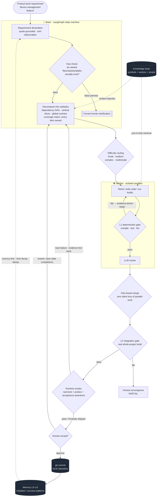
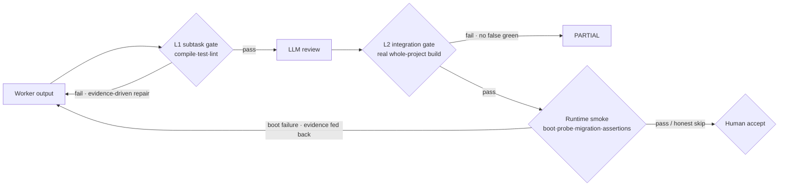
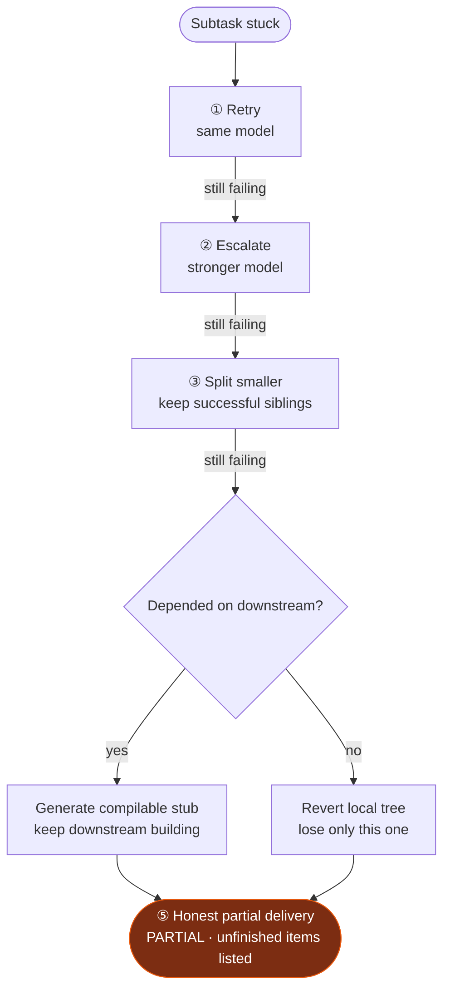

<div align="center">

# 🐝 Swarm

[简体中文](./README.md) | **English**

### A Multi-Agent Engineering System That Owns Its Deliverables

*Not another AI coding assistant — an autonomous engineering team that takes a complete requirement, decomposes and executes it, runs every verification, and hands the result back to you.*

<br/>

[](https://github.com/Victzhang79/Swarm/actions/workflows/ci.yml)
[](LICENSE)
[](https://www.python.org/)
[](https://github.com/langchain-ai/langgraph)
[](#-how-the-system-itself-is-verified)
[](https://github.com/Victzhang79/Swarm/releases)
[](#)

<br/>

**Product-level requirements in · Production-grade artifacts out · Every step traceable · Every token accountable**

[💡 Why](#-why-swarm) ·
[🎬 In 30 Seconds](#-in-30-seconds) ·
[🔄 How It Works](#-how-it-works) ·
[🧭 Design Principles](#-five-design-principles) ·
[🧬 Core Mechanisms](#-core-mechanisms) ·
[🛡️ Security](#️-security-model) ·
[📈 Observability](#-observability--ops-probes) ·
[🚀 Quick Start](#-quick-start) ·
[🏗️ Architecture](#️-architecture)

</div>

---

## 💡 Why Swarm

Large language models are great at writing code — and equally great at **confidently delivering the wrong thing**.

In a world full of coding agents, the bottleneck is no longer "getting AI to write code." It is:

> **How do you get a fleet of autonomous AIs to do the work correctly, completely, within budget — with every step traceable — when nobody is watching?**

Swarm is our complete answer to that question: hand a product-level requirement to an agent team with **division of labor, verification, budgets, and memory**. A large model does planning and adjudication; massive parallel execution goes to small models. And whether a deliverable can be trusted never depends on any model's self-assessment — only on **deterministic evidence**.

| | 🧑‍✈️ Copilot-style assistants<br/>(Cursor / Copilot / Claude Code) | 🐝 Swarm |
|---|---|---|
| **Collaboration** | Sits next to you; you review every line | Takes the whole requirement; decomposes, executes, verifies, hands back |
| **Optimizes for** | Individual typing speed | **Delivery credibility with nobody watching** |
| **Requirement fulfillment** | You check what got done | **Itemized requirements + coverage matrix + executable acceptance assertions** — every requirement has a ledger entry |
| **Verification** | You judge correctness | **Deterministic gates** (compile / test / lint / real boot / API assertions) first, LLM review second, human accept last |
| **Failure handling** | You take over | **Graduated recovery ladder** + honest partial delivery; successful work is never thrown away |
| **Cost control** | Pay whatever it burns | **Per-task budget ledger**: reserve-settle, deterministic circuit-break on overrun, auditable spend |
| **Learning** | Starts from zero every time | **Layered memory + curated experience library** — grows with your project |

> The more autonomous agents become, the more indispensable the "trusted delivery" layer is — and that is exactly where all of Swarm's engineering goes.

---

## 🎬 In 30 Seconds

**One-sentence product requirement → full-stack modules built end to end, compiling, runnable, and reconcilable against every requirement item.**

```
You:            "I need a device-management feature"
                        │
  Brain structures the requirement into an itemized list,
  each item quoting the original text (anti-hallucination)
                        │
  Translated into file-level technical design → dependency DAG ·
  vertical slices · global contract
                        ▼
┌─────────────── Produced autonomously ────────────────┐
│  📄 Device.java              (entity)                 │
│  📄 DeviceMapper.java + .xml (persistence)            │
│  📄 DeviceService(+Impl).java(business)               │
│  📄 DeviceController.java    (API)                    │
│  📄 device.html / device.js  (frontend)               │
│  🗄️ sys_device               (DDL)                    │
└───────────────────────────────────────────────────────┘
  ✅ L1 compile  ✅ L2 integration build  ✅ real boot  ✅ API assertions
```

Most of the time you never name a file or review line by line — you describe *what* you want, Swarm is responsible for *building it correctly*, and the human-review panel gives you a **complete reconciliation report**: which requirements are covered by which changes, which API assertions actually passed, and which items were honestly marked "needs human confirmation" due to environment limits.

> The demo above is a Java monolith; **the same orchestration holds for Go / Rust / TypeScript / Python / Vue frontend-backend projects** —
> the tech stack is authoritatively detected from disk (never trusted from docs), and layering conventions, build commands,
> acceptance criteria, and deterministic repair toolchains all switch with the stack.

---

## 🔄 How It Works

A requirement flows through **Brain orchestration → difficulty routing → sandboxed Worker execution → three verification layers → memory loop**:



---

## 🧭 Five Design Principles

Swarm's credibility does not come from "using a stronger model." It comes from five engineering principles that run through the entire system:

1. **Deterministic adjudication; LLMs advise.** Whether something ships is decided by compilers, tests, and real HTTP responses. LLM opinions (reviews, scores, self-assessments) are advisory — never authorized to approve a delivery.
2. **Fail-closed by default.** A tool that cannot run is never counted as "verification passed"; parse failures are treated as unscanned; safety and correctness states default to *no*. Better an honest PARTIAL than a silent false green.
3. **The books must balance.** Every requirement item, every subtask, every model call, every token has a ledger: requirement coverage matrix, three-account progress (done / abandoned / remaining), per-task budget ledger, machine-readable degradation summary.
4. **Monotonic convergence.** Coverage and completion sets only grow (any regression fails loud); replanning patches incrementally instead of re-decomposing from scratch; failures walk a bounded recovery ladder — successful work is never discarded, retries are never unbounded.
5. **Degradation must be observable.** Every skip, truncation, fallback, or abandonment leaves a structured trace that reaches the final report — "not verified" and "verified" are always distinguishable in the data.

---

## 🧬 Core Mechanisms

### 📋 Requirements as Contracts

The first distortion in traditional AI coding happens upstream: the model reads a document and starts working "from understanding" — nobody reconciles what was actually built against what was written. Swarm turns requirements into an **executable contract**:

- **Itemization with quote grounding**: the PRD is structured into items, each verifiably quoting the source text — hallucinated "requirements" cannot enter the list. Extraction has per-round quality gates, and a good round is never clobbered by a worse retry.
- **Coverage matrix**: every subtask declares which items it covers; uncovered requirements **reject the plan** and feed back into bounded replanning. Small residual gaps may pass in degraded mode after patch attempts — but stay visible all the way to the human-review panel.
- **Baseline claims for brownfield**: plans may declare "the existing code already satisfies this item" (with evidence). Claims are commitments: automatically verifiable ones get executed as assertions during smoke; the rest are honestly downgraded and surfaced for human veto.
- **Executable acceptance assertions**: requirement items generate HTTP black-box assertions (e.g. `POST /api/device → 201`) executed against the **actually running application**; endpoints requiring auth get a login-then-assert flow — and login infrastructure failures are honestly ruled *inconclusive* instead of blaming the code.
- **Fact-checking before planning**: files/classes/tables named by the requirement are checked against both the working tree and git-tracked ground truth — false premises force human clarification instead of a doomed run.

### 🧠 Orchestration & Parallelism

- **Product language is enough** — the system translates fuzzy requirements into a file-level technical design before planning.
- **Vertical slices + a real dependency DAG**: a complete feature ships as one subtask (not shattered per file); batches connect only along **real module dependencies**, stripping artificial serial chains so independent work runs fully parallel.
- **Global shared contract**: cross-module interfaces/DTOs/API specs are produced before parallel execution and injected into every Worker; contracts merge precisely by `(module, interface)` so same-named interfaces across modules are never wrongly fused.
- **Write-set module locking**: concurrent tasks lock the combination of **all top-level modules they write**; overlapping write-sets exclude each other, disjoint ones run in parallel, and lock-upgrade conflicts queue with a bound — never "paper mutual exclusion."
- **Batched decomposition for very large requirements**: hundreds of files proceed module by module with visible progress, under the same coverage and verification discipline as single-shot plans.

### ✅ Three Verification Layers



- **L1 subtask gate**: outputs pass compile/test/lint hard gates first; repair rounds are driven by real build evidence; rework clears stale completion state. Outputs with zero semantic-correctness coverage (code but no test/verify commands) are explicitly flagged into human review.
- **L2 integration gate**: a real whole-project build (Java multi-module reactor / per-stack equivalents); a missing toolchain **refuses to pass rather than silently skipping**; contract completeness is enforced by missing-ratio, and missing symbols are **attributed per symbol with word-boundary matching** to the responsible subtasks for targeted redispatch.
- **Runtime smoke + acceptance**: compiling isn't running — the app is **actually booted** in the sandbox (start command and port derived from manifest evidence, stack-symmetric), TCP/HTTP probed, DB migrations executed, then acceptance assertions run item by item. Boot failures are evidence-classified three ways: code errors feed back for targeted repair; environment gaps skip honestly without blaming the code; ambiguous cases skip conservatively.
- **Human gate**: the review panel presents the full reconciliation — coverage matrix, per-assertion verdicts, smoke/migration conclusions, baseline claims, items needing human review, and every degradation reason. The human is the final gate, and gets **all the facts**, not a model's self-summary.

### 🔀 Fail-Closed Merging

The most insidious distortion in parallel agent systems is the merge: when dozens of Workers' diffs collapse into one deliverable, anything "quietly dropped" means the whole run was wasted. Swarm seals every loss path:

- **Multi-writer new files** with divergent content send losers into a rebase channel for regeneration — with the **winner's latest content injected** into the retry, breaking the "regenerate the same conflict on a stale base" loop;
- **3-way merges validate the base first**: hunks whose context doesn't match the actual file (base drift) are rejected outright — no semantically corrupted "clean" merges;
- **Hard conflict markers** (`<<<<<<<`) never enter the delivery diff — conflict renderings go to a separate diagnostic file;
- **Rebase-limit overruns split by origin**: dropped real source code must escalate to a human — never silently shipped;
- **Every removal is booked**: abandoned subtasks join the abandonment list; the terminal state is an honest, itemized `PARTIAL`, never a fake `DONE`.

### 🪜 Failure Recovery



Beneath the ladder sits a full **abort & recovery protocol** for systemic surprises:

- **Retries don't start from zero**: task retries are seeded with the previous run's verified outputs and requirement-coverage watermark — correct work is inherited;
- **An independent watchdog** guards wall-clock and lock renewal on its own timer — a hang inside any node no longer means unprotected execution;
- **Terminal writes are CAS-guarded**: a late background write can never "resurrect" a cancelled task;
- **Resource-type aborts uniformly salvage to PARTIAL**: wall-clock exhaustion, lock loss, token overrun — completed work is rescued before the terminal state settles; hours of work are never dropped as a bare FAILED;
- **Infrastructure self-heals**: PG checkpointer connection pooling with liveness rebuild, periodic orphan reconciliation, sandbox templates auto-resolving to actually available images.

### 💰 Cost & Resilience

- **Per-task budget ledger (TaskLedger)**: every model call passes a single reserve-settle gate; **error paths are booked too** (tokens burned by timeouts/cancellations are no longer invisible); the ledger persists across restarts; every retry layer draws from the same ledger — a saturated provider can no longer burn a task into a bottomless pit; overruns circuit-break deterministically and salvage partial delivery.
- **Provider resilience**: process-level circuit breakers with half-open recovery; automatic failover when the primary model stalls (a streaming watchdog judges stalls by chunk gaps — active streams are never killed by mistake); per-provider concurrency caps; multi-level fallback chains for every Worker model.
- **Elastic wall-clock**: execution deadlines scale with task size (baseline + per-subtask increment) — large legitimate tasks aren't killed, runaway ones are bounded.
- **Small-model competence**: Workers default to parallel local small models — ReAct history trimmed to budget, partial file reads, tight scopes, an on-demand tool surface, and time budgets threaded through every verification stage keep small models stable over long runs.

### 📚 Knowledge + Memory + Experience

- **Code knowledge base**: symbol tables + vector retrieval (embedding + rerank, cloud or self-hosted) inject precisely relevant code per task; Workers can also retrieve just-in-time. Syntax-aware chunking across languages, multi-source ingestion (PDF/Word/HTML/images).
- **Layered memory L0–L6**: every review verdict becomes memory that shapes future orchestration. Time-aware decay fades stale cases; recency-fused ranking and cross-encoder reranking sharpen recall; automatic consolidation keeps the store clean as it grows.
- **Pluggable experience layer**: one `.md` file = one skill, hot-pluggable with zero code. The selector routes by **stack × intent × phase**, with framework-level relevance (a FastAPI project will never be handed Django advice) and database-dependency detection (MySQL guidance mounts only when MySQL is detected). The single most relevant stack-specialized skill is pushed full-text into the prompt; the rest mount as on-demand tools with trigger-condition descriptions so small models pick precisely. System-level authoring/import via WebUI passes a strict admission gate (schema / secret scan / prompt-injection interception / title-body intent consistency), with a **mount preview** before saving. Experience is always advisory — it can never bypass a deterministic gate.

### 🌐 Stack-Agnostic by Design

| Layer | Coverage | Mechanism |
|---|---|---|
| Stack detection | Java/Go/Rust/TS·JS/Python/Vue mixed | Disk manifests are authoritative (pom/gradle/go.mod/Cargo.toml/package.json/pyproject) — docs are never trusted; database dependency facet also detected |
| Build/acceptance | Automatic per stack | `mvn`/`gradle`/`go build`/`cargo build`/`npm build`/py_compile; acceptance commands travel with the harness |
| Lint | 5 languages | checkstyle / go vet / clippy / eslint / ruff (tool failure ≠ code failure) |
| Deterministic repair | Java/Go/Rust/TS | Ecosystem-standard tools: Java import/dependency self-evidence, `goimports`, `cargo fix`, `eslint --fix` |
| Dependency completion | Driver-based per stack | Authoritative coordinates from the project's **own sibling manifests** (never fabricated, fail-closed); new stack = register one driver |
| Layer templates | Java/Vue/TS/Go/Python | New files get in-project exemplars of the same kind injected |
| De-specialized planning | All | No project names or single-stack hardcoding in grouping/splitting/prompts (locked by regression tests) |

---

## 🔬 How the System Itself Is Verified

A system that ships code for you must hold its own code to the same standard. **Swarm's engineering methodology is part of the product**:

- **3800+ behavioral tests** run on a pristine PostgreSQL + Python 3.12 CI; every commit must be green. Tests assert **behavior, not structure** — refactors don't shatter them; bug fixes start with a red reproduction (test-first); when semantics deliberately evolve, old tests are explicitly updated with mechanism annotations, never quietly bent.
- **Every fix batch passes adversarial dual review**: an independent code-reviewer and a silent-failure-hunter review from opposite directions — one verifies claimed fixes actually hold, the other hunts swallowed exceptions, bad fallbacks, dead keys nobody reads, and "configured but never effective." Reviews name seven blind-spot classes (lock-key consistency, all call sites, lost work signals in terminal states, probe transience, thread topology, sticky-key lifecycle, fail-open symmetry); everything found is fixed in the same batch.
- **The configuration surface is frozen with teeth**: all 200+ environment switches are registered in a single source of truth; adding a switch without registering turns CI red — the "every run uses a never-fully-verified config combination" hazard is institutionally eliminated. Frozen dev/e2e/prod profiles ship alongside.
- **State-channel schema consistency is guarded**: the orchestration framework silently drops undeclared state keys (empirically verified), so "every key a node writes must be declared" is test-enforced — no dead features that write to nobody.
- **Fail-closed is the default philosophy** — better an honest PARTIAL than a silent false green.

---

## 🛡️ Security Model

Designed for **intranet multi-user** deployments, with explicit trust boundaries at every layer:

| Layer | Mechanism |
|---|---|
| **AuthN/AuthZ** | Multi-user tokens + RBAC (global roles + per-project membership); forced password change on first login; tokens stored as SHA256 at-rest hashes with rotation on login; optional `SWARM_TOKEN_TTL_HOURS` |
| **Browser sessions** | HttpOnly cookies on the main path; no `?token=` URLs over HTTP; programmatic clients use the `Authorization` header; revocation cuts streams immediately |
| **API surface** | Topology-revealing endpoints require auth; `/docs` `/openapi.json` gated by default in production (`SWARM_DOCS_PUBLIC` overrides both ways, fail-closed on config errors) |
| **Command execution** | Sandbox commands pass a **hardened blocklist** (DB-managed rules; load failure falls back to a built-in baseline — `rm -rf /`-class commands are never released) |
| **Execution isolation** | Sandbox isolation via CubeSandbox; host and target workspaces protected by path-boundary validation |
| **Secrets** | LLM keys encrypted at rest via `secret_store`; delivery diffs pass a secret-leak scan (CRITICAL findings block delivery and escalate) |
| **Production gate** | `SWARM_ENV=production` self-check refuses to start on weak root keys / default passwords / weak DB credentials / RBAC off; unsafe hot-config changes are atomically rolled back |
| **Injection surfaces** | `shlex.quote` on critical shell paths; SSRF/traversal validation on upload/ingest; prompt-injection interception at the skill admission gate |

---

## 📈 Observability & Ops Probes

| Endpoint | Purpose | Semantics |
|---|---|---|
| `GET /api/health` | Liveness | Anonymous, no component details |
| `GET /api/health/ready` | Readiness (container HEALTHCHECK) | Fail-closed real probing: PG always, Redis if enabled, Qdrant with local fallback; any enabled dependency unreachable → 503 |
| `GET /api/status` | Component panel (authenticated) | Real connectivity for 8 components; same probe implementation as `/ready` |
| `GET /api/metrics` | Metrics | Task/sandbox/model-call counters |
| `GET /api/observability/*` | Latency / slow queries / time series | Model-call and critical-path observation |
| Task terminal report | Machine-readable `degraded_summary` | What degraded this run and how many times — aggregated by mechanism, full detail preserved |
| Task/sandbox logs | `swarm.log` + per-sandbox JSONL | End-to-end traceability (every LLM call, sandbox command, gate verdict) |

Ops extras: startup + periodic orphan reconciliation, stall watchdog, audit events, auditable per-task token ledger, and a full E2E script suite (`scripts/e2e_*`).

---

## 📦 Requirements

### Runtime dependencies

| Dependency | Version | Required | Notes |
|---|---|:---:|---|
| Python | ≥ 3.11 | ✅ | 3.12 recommended |
| PostgreSQL | 16 + [pgvector](https://github.com/pgvector/pgvector) | ✅ | Tasks/projects/memory/vector metadata |
| [Qdrant](https://qdrant.tech/) | ≥ 1.13 | ✅ | Code vectors; setup.sh auto-installs |
| LLM endpoint | OpenAI-compatible | ✅ | At least one (cloud key or local inference) |
| [CodeGraph CLI](https://github.com/colbymchenry/codegraph) | latest | ⬜ | Symbol tables; skipped gracefully if absent |
| CubeSandbox / E2B | — | ⬜ | Isolated execution; local execution if unset |
| Embedding / Rerank | OpenAI-compatible | ⬜ | Cloud or self-hosted; falls back to fastembed |
| [Redis](https://redis.io/) | ≥ 6 | prod-recommended | Cross-process locks · queue persistence · lock renewal |
| [Docker](https://docs.docker.com/) + Compose v2 | — | ⬜ | Only for the Docker path |

**OS**: macOS (Apple Silicon) / Ubuntu 22.04+ / Debian / RHEL family (setup.sh adapts brew / apt / dnf).

> **Topology**: single process + PostgreSQL + Redis. Enable Redis with `SWARM_REDIS_ENABLED=true`;
> production should also set `SWARM_REQUIRE_PG_CHECKPOINTER=1` so human-gate states survive restarts.
> Recommended frozen profiles: `config/profiles/{dev,e2e,prod}.env`.

### ⚠️ Target-project toolchains (important)

Swarm's L1/L2 gates **really compile the target project** — the environment running the build must have that project's toolchain (JDK matching the project's version, Go, Rust, Node, …).

- **With an isolated sandbox (recommended / production)** → sandbox images bake in the detected stack's toolchain automatically; the Swarm host needs nothing.
- **Without a sandbox (local execution)** → the host must provide the target stack's toolchain, or gates will honestly converge to `PARTIAL` rather than fake a green.

---

## 🚀 Quick Start

### Option 1 — Docker (fastest)

```bash
git clone https://github.com/Victzhang79/Swarm.git
cd Swarm/swarm                   # project root is the inner swarm/ directory
cp .env.docker.example .env      # fill LLM keys as needed (optional; configurable in WebUI)
docker compose up -d --build     # postgres + qdrant + swarm
```

Open **http://localhost:8420** (default login `admin` / `swarm`, forced password change on first login).

> Docker packages **Swarm itself**; **CubeSandbox is a separate service** connected via `SWARM_SANDBOX_*` (local execution if unset).

### Option 2 — One-shot installer (bare metal)

```bash
git clone https://github.com/Victzhang79/Swarm.git
cd Swarm/swarm
bash setup.sh           # 9 automated steps: deps→pgvector→PG→venv→install→DB→CodeGraph→.env→Qdrant→start
```

Options: `--skip-pg` · `--skip-codegraph` · `--skip-env` · `--dev` · `--help`.

### Option 3 — Manual

```bash
createdb swarm && psql -d swarm -c "CREATE EXTENSION IF NOT EXISTS vector;"
python3.12 -m venv .venv && source .venv/bin/activate && pip install -e .
cp .env.example .env
python scripts/init_db.py
bash scripts/start-services.sh
```

Verify: `curl http://localhost:8420/api/health` · open `http://localhost:8420`.

---

## 🏗️ Architecture

| Module | Directory | Responsibility |
|---|---|---|
| API + Web UI | `api/` | FastAPI service + static frontend |
| **Brain** | `brain/` | LangGraph orchestration (translate · decompose · dispatch · merge · verify) |
| **Worker** | `worker/` | ReAct agent · L1 deterministic verification · sandbox builds |
| Knowledge | `knowledge/` | Retrieval · embedding · rerank · incremental scheduling |
| Memory | `memory/` | L0–L6 layered memory · time decay · consolidation |
| Experience | `experience/` | Curated skill library · stack×intent×phase routing · push+pull injection |
| Project | `project/` | PG storage · preprocessing · diff application · sandbox inference |
| Infra | `infra/` | Coordination primitives · leader election · sandbox pool · checkpoint GC |
| Models | `models/` | Multi-endpoint routing · budget ledger · circuit breakers |
| Config | `config/` | pydantic-settings · encrypted secrets · env-switch registry |
| CLI | `cli/` | Click command line |

**Ports**: Swarm API + Web UI `8420` · Qdrant `6333/6334` · PostgreSQL `5432` · Redis `6379` (off by default).

---

## 🧪 Testing

```bash
bash test/run_all.sh                                    # all tests
.venv/bin/python -m pytest test/ -q                     # equivalent
.venv/bin/ruff check . --select E9,F63,F7,F82           # critical lint (same as CI)
```

CI runs lint plus the full suite on pristine PostgreSQL (pgvector) + Python 3.12 (currently **3800+ passed**),
plus a Docker Smoke workflow for the three-container compose stack. Test discipline: **behavioral assertions first**,
red reproduction before every bug fix, adversarial dual review (code-reviewer + silent-failure-hunter) on every batch.

---

<div align="center">

## 📄 License

[MIT](LICENSE) · Built with 🐝 and deterministic gates

</div>
