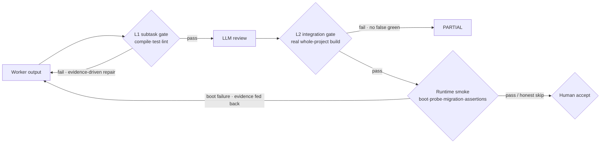
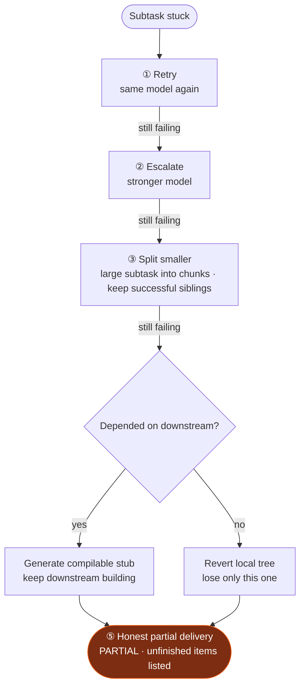
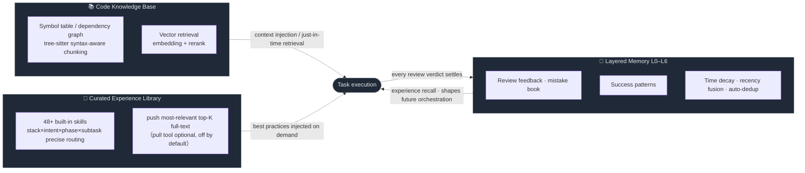

<div align="center">

# 🐝 Swarm

[简体中文](./README.md) | **English**

### A Multi-Agent Engineering System That Owns Its Deliverables

*Not another AI coding assistant — an autonomous engineering team that takes a complete requirement, decomposes and executes it, runs every verification, and hands the result back to you.*

<br/>

[](https://github.com/Victzhang79/Swarm/actions/workflows/ci.yml)
[](LICENSE)
[](https://www.python.org/)
[](https://github.com/langchain-ai/langgraph)
[](#-how-the-system-itself-is-verified)
[](https://github.com/Victzhang79/Swarm/releases)
[](#)

<br/>

**Product-level requirements in · Production-grade artifacts out · Every step traceable · Every token accountable**

[💡 Why](#-why-swarm) ·
[🎬 In 30 Seconds](#-in-30-seconds) ·
[🔄 How It Works](#-how-it-works) ·
[🧭 Design Principles](#-five-design-principles) ·
[🧬 Core Mechanisms](#-core-mechanisms) ·
[🛡️ Security](#️-security-model) ·
[📈 Observability](#-observability--ops-probes) ·
[🚀 Quick Start](#-quick-start) ·
[🏗️ Architecture](#️-architecture)

</div>

---

## 💡 Why Swarm

Large language models are great at writing code — and equally great at **confidently delivering the wrong thing**.

In a world full of coding agents, the bottleneck is no longer "getting AI to write code." It is:

> **How do you get a fleet of autonomous AIs to do the work correctly, completely, within budget — with every step traceable — when nobody is watching?**

Swarm is our complete answer to that question: hand a product-level requirement to an agent team with **division of labor, verification, budgets, and memory**. A large model does planning and adjudication; massive parallel execution goes to small models. And whether a deliverable can be trusted never depends on any model's self-assessment — only on **deterministic evidence**.

| | 🧑‍✈️ Copilot-style assistants<br/>(Cursor / Copilot / Claude Code) | 🐝 Swarm |
|---|---|---|
| **Collaboration** | Sits next to you; you review every line | Takes the whole requirement; decomposes, executes, verifies, hands back |
| **Optimizes for** | Individual typing speed | **Delivery credibility with nobody watching** |
| **Requirement fulfillment** | You check what got done | **Itemized requirements + coverage matrix + executable acceptance assertions** — every requirement has a ledger entry |
| **Verification** | You judge correctness | **Deterministic gates** (compile / test / lint / real boot / API assertions) first, LLM review second, human accept last |
| **Failure handling** | You take over | **Graduated recovery ladder** + honest partial delivery; successful work is never thrown away |
| **Cost control** | Pay whatever it burns | **Per-task budget ledger**: reserve-settle, deterministic circuit-break on overrun, auditable spend |
| **Learning** | Starts from zero every time | **Layered memory + curated experience library** — grows with your project |

> The more autonomous agents become, the more indispensable the "trusted delivery" layer is — and that is exactly where all of Swarm's engineering goes.

---

## 🎬 In 30 Seconds

**One-sentence product requirement → full-stack modules built end to end, compiling, runnable, and reconcilable against every requirement item.**

```
You:            "I need a device-management feature"
                        │
  Brain structures the requirement into an itemized list,
  each item quoting the original text (anti-hallucination)
                        │
  Translated into file-level technical design → dependency DAG ·
  vertical slices · global contract
                        ▼
┌─────────────── Produced autonomously ────────────────┐
│  📄 Device.java              (entity)                 │
│  📄 DeviceMapper.java + .xml (persistence)            │
│  📄 DeviceService(+Impl).java(business)               │
│  📄 DeviceController.java    (API)                    │
│  📄 device.html / device.js  (frontend)               │
│  🗄️ sys_device               (DDL)                    │
└───────────────────────────────────────────────────────┘
  ✅ L1 compile  ✅ L2 integration build  ✅ real boot  ✅ API assertions
```

Most of the time you never name a file or review line by line — you describe *what* you want, Swarm is responsible for *building it correctly*, and the human-review panel gives you a **complete reconciliation report**: which requirements are covered by which changes, which API assertions actually passed, and which items were honestly marked "needs human confirmation" due to environment limits.

> The demo above is a Java monolith; **the same orchestration holds for Go / Rust / TypeScript / Python / Vue frontend-backend projects** —
> the tech stack is authoritatively detected from disk (never trusted from docs), and layering conventions, build commands,
> acceptance criteria, and deterministic repair toolchains all switch with the stack. No single stack or sample project is
> hardcoded anywhere in the planning logic.

---

## 🔄 How It Works

A requirement flows through **Brain orchestration → difficulty routing → sandboxed Worker execution → three verification layers → memory loop**:


---

## 🧭 Five Design Principles

Swarm's credibility does not come from "using a stronger model." It comes from five engineering principles that run through the entire system. Understand them and you understand why every mechanism below looks the way it does:

1. **Deterministic adjudication; LLMs advise.** Whether something ships is decided by compilers, tests, and real HTTP responses. LLM opinions (reviews, scores, self-assessments) are advisory — never authorized to approve a delivery.
2. **Fail-closed by default.** A tool that cannot run is never counted as "verification passed"; parse failures are treated as unscanned; safety and correctness states default to *no*. Better an honest partial delivery than a silent false green.
3. **The books must balance.** Every requirement item, every subtask, every model call, every token has a ledger: requirement coverage matrix, three-account progress (done / abandoned / remaining), per-task budget ledger, machine-readable degradation summary.
4. **Monotonic convergence.** Coverage and completion sets only grow (any regression fails loud); replanning patches incrementally instead of re-decomposing from scratch; failures walk a bounded recovery ladder — successful work is never discarded, retries are never unbounded.
5. **Degradation must be observable.** Every skip, truncation, fallback, or abandonment leaves a structured trace that reaches the final report — "not verified" and "verified" are always distinguishable in the data.

---

## 🧬 Core Mechanisms

### 📋 Requirements as Contracts: from "roughly did it" to "itemized and accounted for"

The first distortion in traditional AI coding happens furthest upstream: the model reads a requirement document and starts working "from understanding" — whether it did all of it, and whether what it did is actually in the document, goes unreconciled. Swarm turns requirements into an **executable contract**:

- **Itemization + quote grounding**: the PRD is first structured into an itemized list, and each item must **quote the source text verbatim** and pass deterministic validation — hallucinated "requirements" cannot enter the list. Extraction quality has per-round gates (if item count is clearly out of proportion to document size, it re-extracts with feedback, and a good round is never clobbered by a worse one).
- **Coverage matrix**: at planning time every subtask explicitly declares which items it covers; uncovered requirements **reject the plan and feed back into bounded replanning**; small residual gaps may pass in degraded mode after ample patch attempts — but the residual stays visible all the way to the human-review panel.
- **Baseline capability claims**: brownfield PRDs often describe capabilities the baseline already has — a plan may declare "the existing code already satisfies this item" (evidence required). A claim is a commitment: automatically verifiable items get their assertions really executed during smoke; the rest are honestly downgraded and surfaced for human veto.
- **Executable acceptance assertions**: requirement items further generate HTTP black-box assertions (e.g. `POST /api/device → 201`), executed item by item against the **actually running application**; endpoints requiring auth automatically obtain a token within smoke and run authenticated assertions — and when the login infrastructure itself fails, the result is honestly ruled *inconclusive* rather than blaming the code.
- **Fact-checking before planning**: before planning, the files/classes/tables named by the requirement are checked against two ground truths — the **working-tree disk and git-tracked** state — to see whether they really exist; a false premise forces human clarification instead of a doomed run.

### 🧠 Orchestration & Parallelism: division of labor like a real engineering team

- **Product language is enough**: just describe "what feature you want" — the system first translates the fuzzy requirement into a file-level technical design, then plans execution.
- **Vertical slices + a real dependency DAG**: a complete feature spanning multiple files ships as one subtask (not shattered per file); batches connect only along **real module dependencies**, stripping the artificial serial chains an LLM wrongly adds, so genuinely independent work runs fully parallel.
- **Global shared contract**: before parallel multi-module work, cross-module interfaces/DTOs/API specs are produced and injected into every Worker, ensuring parallel outputs line up at the interface; contracts merge precisely by `(module, interface)` so same-named interfaces across modules are never wrongly fused.
- **Write-set module locking**: concurrent tasks lock the top-level module combination of **all their write paths** — overlapping write-sets exclude each other, disjoint ones run in parallel as usual, and lock-upgrade conflicts queue with a bound; never "paper mutual exclusion" running concurrently while sick.
- **Batched decomposition for very large requirements**: hundreds of files proceed batch by batch by functional module (progress visible per batch), under the same coverage and verification discipline as single-shot plans.

### ✅ Three Verification Layers: hard evidence at every layer



- **L1 subtask gate**: outputs pass compile/test/lint hard gates first; repair rounds are driven by real compile evidence; rework clears stale completion state to prevent "premature completion." Outputs with zero semantic-correctness coverage (code but no test/verify commands) are explicitly flagged into human review.
- **L2 integration gate**: a real whole-project build (Java multi-module reactor / per-stack equivalents); a missing toolchain **refuses to pass rather than silently skipping**; contract completeness is enforced with teeth by missing-ratio, and missing symbols are **attributed per symbol with word-boundary matching** to the responsible subtask for targeted redispatch (when attribution fails it falls back to all — never leaving a fix undone).
- **Runtime smoke + acceptance**: compiling isn't running — the app is **actually booted** in the sandbox (start command and port derived from manifest evidence, stack-symmetric), TCP/HTTP probed, DB migrations executed and verified, then acceptance assertions run item by item. Boot failures are evidence-classified three ways: code errors feed back for targeted repair; environment gaps skip honestly without blaming the code; ambiguous cases skip conservatively.
- **Human gate**: the review panel presents the full reconciliation — coverage matrix, per-assertion verdicts, smoke/migration conclusions, baseline claim list, items needing human review, and every degradation reason. The human is the final gate, and gets **all the facts**, not a model's self-summary.

### 🔀 Fail-Closed Merging: not one line of parallel work may silently disappear

The most insidious distortion in parallel agent systems is the merge: when dozens of Workers' diffs collapse into one deliverable, anything "quietly dropped" means the whole run was wasted. Swarm seals every loss path one by one:

- **Multi-writer new files** with divergent content send losers into a rebase channel for regeneration — and the retry has the **winner's latest content injected**, breaking the "regenerate the same conflict on a stale base" loop;
- **3-way merges validate the base first**: when hunk context doesn't match the actual file (base drift), it is rejected outright — never producing a semantically corrupted "clean" merge;
- **Hard conflict markers** (`<<<<<<<`) never enter the delivery diff — conflict renderings go to a separate diagnostic file;
- **Rebase-limit overruns split by origin**: dropped real source code must escalate to a human — never silently shipped;
- **Every removal is booked**: abandoned subtasks join the abandonment list; the terminal state is an honest, itemized `PARTIAL`, never a fake `DONE`.

### 🪜 Failure Recovery: digest step by step, never start over



Beneath the ladder sits a full **abort & recovery protocol** to catch systemic surprises:

- **Retries don't start from zero**: task retries are seeded with the previous run's verified outputs and requirement-coverage watermark — correct work is inherited directly and retry cost drops sharply;
- **Independent watchdog**: wall-clock and lock renewal are guarded by a watchdog on its own timer — a hang inside any node no longer means protection fails;
- **Terminal writes are CAS-guarded**: a late background write can never "resurrect" a cancelled task into an active state;
- **Resource-type aborts uniformly salvage to PARTIAL**: wall-clock exhaustion, lock loss, token overrun — completed work is always rescued before the terminal state settles; hours of work are never dropped as a bare FAILED;
- **Infrastructure self-heals**: PG checkpointer connection-pool liveness rebuild, periodic orphan reconciliation, sandbox templates auto-resolving to actually available images.

### 💰 Cost & Resilience: every token accounted for, every stall has a way out

- **Per-task budget ledger (TaskLedger)**: every model call passes a single reserve-settle gate, and **error paths are booked too** (tokens burned by timeouts/cancellations are no longer blind); the ledger persists across restarts; every retry layer draws from the same ledger — a saturated provider can no longer burn one task into a bottomless pit, overruns circuit-break deterministically and salvage partial delivery.
- **Provider resilience**: process-level circuit breakers + half-open recovery; automatic failover when the primary model stalls (a streaming watchdog judges stalls by chunk gaps — active streams are never killed by mistake); per-provider concurrency caps to avoid tripping rate limits; multi-level fallback chains for every Worker model.
- **Lossless self-heal on runaway chain-of-thought**: cloud reasoning models can spin in place inside the chain-of-thought — they keep emitting chunks so the stall watchdog reads "healthy," while `max_tokens` only caps the final answer (reasoning content is exempt); we measured a single call burning 25 minutes without converging. The lever is one fact: **before the body emits its first character, a mid-stream abort is lossless** (downstream received not a single chunk) → when the thinking phase goes over budget, abort, and **first re-run on a model that doesn't run away (full reasoning capability retained)**; only when the entire fallback chain is exhausted do we fall back to disabling thinking and reopening the stream. The order cannot be reversed: disabling thinking does rescue the flow, but empirically **drops requirements** (same PRD: 106 items → 92, whole features vanish) — the delivery baseline is silently degraded.
- **Elastic wall-clock**: the execution-phase deadline widens automatically with task size (baseline + per-subtask increment) — large tasks aren't killed by mistake, runaway tasks stay bounded.
- **Small-model competence**: Workers default to parallel local small models — ReAct history trimmed to budget, partial file reads, precisely narrowed scope, an on-demand tool surface, and time budgets threaded through every verification stage keep small models stable over long runs.

### 📚 Knowledge + Memory + Experience: it grows with you



- **Code knowledge base**: symbol table + vector retrieval (embedding + rerank, cloud or self-hosted) inject precisely relevant code per task; Workers can also retrieve just-in-time. Multi-language syntax-aware chunking + multi-source ingestion (PDF/Word/HTML/images).
- **Layered memory L0–L6**: every review verdict settles into memory that shapes future orchestration and generation. Time-aware decay fades old cases while fresh lessons take priority; recency-fused ranking + cross-encoder reranking sharpen recall; fragments auto-consolidate so the store gets cleaner as it grows.
- **Pluggable experience layer**: one `.md` file = one skill, hot-pluggable with zero code. The selector routes precisely by **stack × intent × phase × subtask content**: it reads both the engineering profile (framework-level relevance — a FastAPI project is never handed Django advice, a Gradle project never handed Maven experience; database-dependency detection — MySQL experience mounts only when MySQL is detected) and **what this subtask is actually writing** (writing a pom gets build experience, writing a Mapper gets persistence experience, writing auth gets security experience), while still keeping the stack's general coding conventions. The most relevant top-K experiences go full-text straight into the prompt (empirically, small models show zero adoption of "fetch tools on demand," so the pull tool is off by default, with a switch to fall back). System-level authoring/import (WebUI-managed) passes a strict admission gate on every entry (schema / secret scan / prompt-injection interception / title-body intent-consistency adjudication), and a **mount preview** is available before saving — showing exactly which projects' which tasks this skill will surface in. Experience is always advisory — it can never bypass any deterministic gate.

### 🌐 Multi-Stack: not "Java plus a few others" but stack-agnostic by design

| Layer | Coverage | Mechanism |
|---|---|---|
| Stack detection | Java/Go/Rust/TS·JS/Python/Vue mixed | Disk manifests are authoritative (pom/gradle/go.mod/Cargo.toml/package.json/pyproject) — the requirement doc's self-description is never trusted; the database dependency facet is detected too |
| Build/acceptance | Automatic per stack | `mvn`/`gradle`/`go build`/`cargo build`/`npm build`/py_compile; acceptance commands travel with the harness, no stack hardcoded |
| Lint | 5 languages | checkstyle / go vet / clippy / eslint / ruff (tool failure ≠ code failure — transient infra failures are identified separately) |
| Deterministic repair | Java/Go/Rust/TS | Delegates to each ecosystem's de-facto tools: Java import/dependency self-evidence, `goimports`, `cargo fix`, `eslint --fix` |
| Dependency completion | Driver-based per stack | Injects authoritative coordinates found in the project's **own sibling manifests** (self-evidenced coordinates only, never fabricated, fail-closed); new stack = register one driver |
| Build-manifest scaffolding | Maven/npm/go (incl. version resolution) | At planning time, **deterministically generates** build manifests for missing modules: Maven→pom (reactor/aggregator parent), npm→package.json (internal `workspace:*` + third-party `^ver`), go→go.mod (internal `replace` + third-party `vX.Y.Z`). Third-party versions are resolved against **authoritative registries/proxies** (npmjs/npmmirror, proxy.golang.org/goproxy.cn, local cache evidence preferred). ★Never fabricate versions/latest/pre-releases — if unresolvable, honestly drop and remove from acceptance at the same source★ (never forcing small models to invent coordinates); cross-stack paths never pollute each other and Maven behavior is byte-for-byte unchanged |
| Delivery-integrity gate | All stacks (5-stack verifier) | Outputs must reconcile against **declarations**: a file declared as must-build but not produced, or a declared dependency coordinate not landing in the manifest = silent under-delivery, caught by the L1 hard gate. Dependency verification dispatches by manifest basename→verifier (pom/gradle/npm/go/cargo), **matching the tail name while ignoring group+version** → immune to BOM management / `${project.version}` / `workspace:*`; unknown stacks fail-open |
| Dependency-coordinate legality gate | Java/Maven (generalizable) | **Before** the build, scans the whole manifest tree: every dependency must be one of【a module of this project / managed by a parent / really existing in the repository】, otherwise **provably unresolvable** → deterministically corrected or pruned. It **does not parse the build tool's error text** (that's whack-a-mole — a different error phrasing misses one), only validates coordinate state; if the repo is unreachable everything is passed (fail-open, better to miss than to over-prune). Why it must be front-loaded: a bad coordinate collapses at *resolution* time and takes down the whole reactor, making every Worker's build gate falsely report "the fault is upstream" |
| Missing-dependency recovery write grant | Grants the correct manifest per stack | Compile failure with a missing dependency → grants write access to the corresponding module's **build manifest** and redispatches (Maven→pom, Go→go.mod, npm→package.json…), never granting a【phantom pom.xml】in a non-Maven project and burning recovery budget |
| Root-aggregator single-writer gate | Root aggregator manifests, all stacks | Structural rewrites of root `pom.xml`/`settings.gradle`/`go.work`/root `Cargo.toml` are non-additive and cannot be safely merged → dual writers hard-fail and converge to a single owner (previously pom.xml only; Gradle/Go now equally guarded) |
| Layer templates | Java/Vue/TS/Go/Python | New files get an in-project exemplar of the same kind injected, avoiding a whole-project exploration that burns budget for nothing |
| De-specialized planning | All | No project name or single-stack hardcoding anywhere in grouping/splitting/prompts (locked by regression tests against reflux) |

<details>
<summary><b>🔧 Expand: more deterministic hardening mechanisms</b></summary>

<br/>

- **Stack authority + deterministic self-repair of mechanical errors**: the tech stack is authoritatively determined by disk detection and injected into every Worker (e.g. "this project uses `jakarta`, not `javax`"). Detection also pins the real infrastructure symbols the project actually has (the real FQNs of cache/response/auth/base classes) — small models can only reuse classes the project really has, and are forbidden from inventing "standard classes." If one still gets it wrong, L1 does not swap models — it delegates to the ecosystem's de-facto tools for a deterministic fix, then reruns the build to confirm; missing dependencies are completed from the project's own pom, wrong version numbers corrected against the repo's real versions. For fabrications that genuinely cannot be self-repaired, they are deterministically identified and the subtask hard-fails rather than burning further retries.
- **Automatic model-unavailable degradation**: every Worker model carries a multi-level fallback chain; when a model is taken offline mid-inference by its endpoint, it switches down level by level so a single model's jitter never drags down the whole round.
- **Idle-free cross-subtask file sync**: when a consumer reads a file another subtask hasn't produced yet, it auto-locates it by filename in the project tree; a file that genuinely hasn't landed gets a clear stop signal and is resolved naturally by BLOCKED backoff at integration time.
- **Shared-contract union merge**: multi-module contracts merge by method/field union rather than "keep the first, discard the rest," eliminating "the discarded version's unique method is missing → downstream can't find the method."
- **Aggregator files don't overwrite each other**: when multiple subtasks concurrently edit the same aggregator manifest (root `pom.xml`/`settings.gradle`/`Cargo.toml`/`go.work`), they collapse by union at the same anchor — no side's registration is lost.
- **Workload never exceeds the execution budget**: before dispatch, each subtask's file count is guaranteed under an upper bound; anything over is split by entity/layer before entering a Worker; the first recovery action on a timeout is to split smaller rather than grind on a bigger model.
- **Systemic fail-closed hardening**: default-deny, write-before-delete for data, temporary verification rollback limited to the touched files (never a whole-repo `clean -fd` that wipes user changes), workspace-boundary recheck on read paths, cross-project resources authorized by ownership.
- **Delivery resilience for large multi-module projects**: root-pom write authority converges to a single owner, internal module dependency-version integrity gate, unregistered modules fail-closed, per-file independent landing (a single bad patch never zeroes out dozens of correct outputs by association).

</details>

---

## 🔬 How the System Itself Is Verified

A system that ships code for you must hold its own code to the same standard. This is the part we are most willing to show — **Swarm's engineering methodology is itself part of the product**:

- **4900+ behavioral tests** run in full on a pristine PostgreSQL + Python 3.12 CI; every commit must be green to merge. Tests assert **behavior, not structure** — nothing is welded to an implementation, so refactors don't shatter them; bug fixes start with a red reproduction (test-first), and when semantics deliberately evolve, old tests are explicitly updated by decision with a mechanism annotation, never quietly bent.
- **Every fix batch passes adversarial dual review**: an independent code-reviewer and silent-failure-hunter review from opposite directions — the former verifies claimed fixes actually hold, the latter hunts swallowed exceptions, bad fallbacks, dead keys written but read by no one, and "configured but never effective." Reviews name seven blind-spot classes (lock-key consistency, all call sites, lost-work signals into terminal state, probe transience, thread topology, sticky-key lifecycle, fail-open symmetry); everything found is fixed in the same batch.
- **The configuration surface is frozen with teeth**: all 200+ environment switches are registered as a single source of truth; adding a switch without registering turns CI red directly — the "every run uses a config combination that was never verified as a whole" hazard is institutionally eliminated; frozen dev/e2e/prod recommended combinations ship alongside.
- **State-channel schema consistency is guarded**: the orchestration framework silently drops undeclared state keys (empirically verified), so "every key a node writes must be declared in the schema" is test-enforced — no dead features that write to nobody.
- **Fail-closed is the default philosophy**: safety/correctness states default to no, a tool that can't run is never counted as "verification passed," degradation must be observable, parse failures are treated as unscanned — better an honest PARTIAL than a silent false green.

---

## 🛡️ Security Model

Designed for **intranet multi-user** deployments, with an explicit trust boundary at every layer:

| Layer | Mechanism |
|---|---|
| **AuthN/AuthZ** | Multi-user tokens + RBAC (global roles + per-project membership); forced password change on first login; tokens stored as SHA256 at-rest hashes and rotated on login (plaintext never persisted); optional `SWARM_TOKEN_TTL_HOURS` bounds the token exposure window (default 0 = never expire, must be set explicitly; production mode warns but does not block) |
| **Browser sessions** | The browser main path prefers **HttpOnly cookies**, with no more `?token=` URLs over HTTP (avoiding log/Referer leakage); programmatic clients use the `Authorization` header; WebSocket keeps `?token=` as the weakest fallback but **logs a deprecation warning on use** (prefer header/same-origin cookie). Revocation cuts the stream immediately, no silent reconnect; the forced-password-change **423 hard gate is enforced at the single auth entry**, read-only endpoints included |
| **API surface** | `/api/status` requires auth **and is role-masked** — non-admins see only component health, internal coordinates (sandbox/remote-sandbox/model/DB topology) are admin-only; config-write endpoints gate the **outbound-endpoint keys** (provider/DB/webhook `*_URL`/`*_URI`-class — redirecting them to an attacker host = credential phishing/MITM) to **admin only**, centralized with a single write-chokepoint backstop (to stop a non-admin owner bypass); login throttling keys on the **real client IP** (reverse-proxy trust via `SWARM_TRUSTED_PROXY_HOPS` for trusted hops, multi-line XFF merged per RFC — preventing a shared proxy IP from causing account-lockout DoS; unset → fail-closed back to the direct peer IP); `/docs` `/openapi.json` are gated by default in production (`SWARM_DOCS_PUBLIC` overrides both ways, config errors fail-closed to a refusal rather than a 500) |
| **Command execution** | Worker sandbox commands pass a **hardened blocklist** (rule library in DB, manageable; load failure falls back to the built-in baseline, `rm -rf /`-class commands never released); every path carrying an agent command passes the same gate |
| **Execution isolation** | Sandbox execution isolation is provided by CubeSandbox (non-root / network policy / resource quotas depend on the remote sandbox and template config); host and target-project workspaces are validated by path boundaries to prevent traversal |
| **Secrets** | LLM keys etc. are encrypted at rest via `secret_store`; commit/log secret-scanning discipline; delivery diffs pass a secret-leak scan (CRITICAL findings block delivery escalation and escalate to a human) |
| **Production gate** | `SWARM_ENV=production` startup self-check: weak root key / default password / weak DB credentials / RBAC off → refuse to start; runtime hot-config changes that produce an unsafe config → atomic rollback, refuse to persist |
| **Injection surfaces** | `shlex.quote` on critical shell-concat paths; SSRF/traversal validation on upload/ingest paths; the LFI trust boundary is set at the task entry; experience-skill admission passes prompt-injection and dangerous-instruction interception |

---

## 📈 Observability & Ops Probes

| Endpoint | Purpose | Semantics |
|---|---|---|
| `GET /api/health` | Liveness probe | Anonymously reachable, no component detail (no topology leak) |
| `GET /api/health/ready` | Readiness (container HEALTHCHECK / orchestrator gate) | Fail-closed real probing: PG always, Redis if enabled, Qdrant with a local-mode fallback; any enabled dependency unreachable → 503. With RBAC on, anonymous callers get only the status bit; detail belongs to the authenticated `/api/status` |
| `GET /api/status` | Component panel (authenticated) | Real connectivity for 8 components, same implementation as `/ready` (no dual-source drift); **non-admins see health only**, internal coordinates (sandbox/model/DB topology) are admin-only |
| `GET /api/tasks/{id}/progress` | Structured progress | Aggregates `remaining/completed/failed/abandoned/total` + per-subtask detail from checkpoint state (**a single authoritative source consistent with the execution-phase MONITOR node, never parses logs**); read-only, `task:read` gated, falls back to task status when there is no checkpoint |
| `GET /api/metrics` | Metrics | Task/sandbox/model-call counters |
| `GET /api/observability/*` | Latency / slow queries / time series | Model-call and critical-path observation |
| Task terminal report | Machine-readable `degraded_summary` | What degraded this run and how many times — aggregated by mechanism for one-glance reading, with full detail preserved for human review |
| Task/sandbox logs | `swarm.log` + per-sandbox JSONL | End-to-end traceability (every LLM call, every sandbox command, every gate verdict) |

Ops accompaniments: startup reconciliation + periodic orphan reconciliation (four-layer task-state consistency recovery), watchdog process (stall detection), audit events (command interception / delivery decisions persisted), auditable per-task token ledger, and a full E2E script suite (environment self-check / baseline cleanup / soak probing / three-way watch, see `scripts/e2e_*`).

---

## 📦 Requirements

### Swarm's own runtime dependencies

| Dependency | Version | Required | Notes |
|---|---|:---:|---|
| Python | ≥ 3.11 | ✅ | 3.12 recommended |
| PostgreSQL | 16 + [pgvector](https://github.com/pgvector/pgvector) | ✅ | Tasks/projects/memory/vector metadata |
| [Qdrant](https://qdrant.tech/) | ≥ 1.13 | ✅ | Code vector store; setup.sh auto-downloads a local binary or uses Docker |
| LLM endpoint | OpenAI-compatible API | ✅ | At least one (cloud key or local inference service) |
| [CodeGraph CLI](https://github.com/colbymchenry/codegraph) | latest | ⬜ | Builds symbol tables / dependency graph; skipped gracefully if absent, main chain unaffected |
| CubeSandbox / E2B | — | ⬜ | Isolated sandbox execution; local Worker execution if left empty |
| Embedding / Rerank service | OpenAI-compatible | ⬜ | Cloud (SiliconFlow etc.) or self-hosted; falls back to built-in fastembed if absent |
| [Redis](https://redis.io/) | ≥ 6 | prod-recommended | Cross-process module locks · queue persistence across restarts · long-run lock renewal protection; optional for single-machine trials |
| [Docker](https://docs.docker.com/) + Compose v2 | — | ⬜ | Needed only for the Docker one-shot path; not for bare-metal |

**OS**: macOS (Apple Silicon) / Ubuntu 22.04+ / Debian / RHEL family (setup.sh adapts brew / apt / dnf).

> **Runtime topology**: the target deployment shape is **single process + PostgreSQL + Redis**. PostgreSQL persists
> tasks/projects/memory and serves as the LangGraph checkpoint store; Redis (production-recommended) provides
> cross-process module mutex, task-queue survival across restarts with self-healing gap-fill, and lock-renewal
> protection for long-running tasks. **The Redis enable switch is `SWARM_REDIS_ENABLED=true`** (filling in a
> connection string alone does not count as enabled; when not enabled the system safely degrades to an in-process
> implementation — fine for single-machine trials but without the above cross-process/cross-restart guarantees).
> For production, also set `SWARM_REQUIRE_PG_CHECKPOINTER=1` to force the PG checkpointer, ensuring interrupted
> states like human review/clarification can resume after a restart. Recommended combinations are in
> `config/profiles/{dev,e2e,prod}.env`.

### ⚠️ Target-project toolchains (important)

Swarm's L1/L2 gates **really compile the target project** — so the environment running the compile must have the toolchain for the target project's stack installed. The build method is chosen automatically by the detected stack:

| Target project stack | Toolchain needed | Build method |
|---|---|---|
| Java | JDK (version must match the target project, e.g. JDK 17) + Maven / Gradle | `mvn` / `gradle` |
| Go | Go toolchain | `go build` / `go vet` |
| Rust | Rust + Cargo | `cargo build` |
| JavaScript / TypeScript | Node.js + npm / pnpm / yarn | `npm run build` etc. |
| Python | Python + pip | Syntax/import validation |

Where the toolchain must live depends on where the Worker runs the compile:

- **With an isolated sandbox (recommended / production)** → the sandbox image bakes in the detected stack's toolchain and version automatically. The Swarm host needs no target-stack toolchain — the sandbox adapts per project. This is the correct way to support "one machine delivering across many stacks."
- **Without a sandbox (local Worker execution)** → the host/container running Swarm must itself install the target project's stack toolchain (with a matching Java version), otherwise the L1/L2 compile gates cannot verify and will honestly rule `PARTIAL` rather than fake a green.

> 💡 **In one line**: to have one machine reliably deliver projects of any stack — configure an isolated sandbox and let the image adapt the toolchain per project.

---

## 🚀 Quick Start

### Option 1 — Docker one-shot (fastest, recommended for trial)

```bash
git clone https://github.com/Victzhang79/Swarm.git
cd Swarm/swarm                   # project root is the inner swarm/ directory
cp .env.docker.example .env      # fill LLM keys etc. as needed (starts without them too; configure in WebUI after login)
docker compose up -d --build     # brings up postgres + qdrant + swarm (three containers)
```

After startup, open **http://localhost:8420** (default login `admin` / `swarm`, forced password change on first login). The startup hook creates tables automatically.

> Docker packages **Swarm itself**; **CubeSandbox (remote sandbox) is a separate service**, not in the compose stack — Workers connect to it via `SWARM_SANDBOX_*`, and execute locally if left empty.

### Option 2 — One-shot installer (bare metal)

```bash
git clone https://github.com/Victzhang79/Swarm.git
cd Swarm/swarm
bash setup.sh           # 9 automated steps: system deps→pgvector→PG→venv→install→DB→CodeGraph→.env→Qdrant→start
```

Common options: `--skip-pg` (existing PG) · `--skip-codegraph` · `--skip-env` · `--dev` (dev deps + smoke) · `--help`.

### Option 3 — Manual install

```bash
createdb swarm && psql -d swarm -c "CREATE EXTENSION IF NOT EXISTS vector;"  # 1. PG16 + pgvector
python3.12 -m venv .venv && source .venv/bin/activate && pip install -e .    # 2. venv + deps
cp .env.example .env             # 3. config (fill API Key / DB URI)
python scripts/init_db.py        # 4. create tables
bash scripts/start-services.sh   # 5. start Qdrant + API
```

Verify: `curl http://localhost:8420/api/health` · open `http://localhost:8420` in a browser.

---

## 🏗️ Architecture

| Module | Directory | Responsibility |
|---|---|---|
| API + Web UI | `api/` | FastAPI service + static frontend |
| **Brain** | `brain/` | LangGraph orchestration state machine (requirement translation · decomposition · dispatch · merge · verify) |
| **Worker** | `worker/` | ReAct agent · L1 deterministic verification · sandbox builds |
| Knowledge | `knowledge/` | Retrieval · embedding · rerank · incremental scheduling |
| Memory | `memory/` | L0–L6 layered memory · time-aware decay · dedup consolidation |
| Experience | `experience/` | Curated skill library · stack×intent×phase routing · push top-K full-text injection (pull optional) |
| Project | `project/` | PG storage · preprocessing · diff application · sandbox inference |
| Infra | `infra/` | Coordination primitives · leader election · sandbox pool · checkpoint GC |
| Models | `models/` | Multi-endpoint routing · budget ledger · circuit breakers |
| Config | `config/` | pydantic-settings · encrypted secret storage · env-switch registry |
| CLI | `cli/` | Click command line |

**Ports**: Swarm API + Web UI `8420` · Qdrant `6333/6334` · PostgreSQL `5432` · Redis `6379` (off by default).

---

## 🧭 Daily Ops

| Command | Effect |
|---|---|
| `docker compose up -d` / `down` | Docker: bring up / stop the full stack (`down -v` clears data volumes) |
| `bash setup.sh` | Bare-metal one-shot install + start (first time) |
| `bash scripts/start-services.sh` | Start Qdrant + API (daily) |
| `bash scripts/restart-api.sh` / `stop-api.sh` | Reload / stop the API |
| `bash test/run_all.sh` | Run all tests |
| `swarm submit -p <project_id> --watch` | CLI: submit a task and track it |

### 🖥️ CLI commands at a glance

The CLI is fully HTTP-based and carries the token automatically (after `swarm login`, each command reuses `~/.swarm/cli_token`), managing projects/tasks/knowledge base/members end to end:

| Group | Commands |
|---|---|
| Auth | `swarm login` |
| Project | `swarm project list / create / show / delete / stats` |
| Preprocess | `swarm preprocess run <pid>` · `swarm preprocess status <pid>` |
| Task | `swarm submit` · `swarm task list -p <pid>` · `swarm task approve/revise/reject/cancel/retry/apply-diff` |
| Knowledge | `swarm kb overview/symbols/norms` · `swarm kb retrieve "<query>" -p <pid>` |
| Member/RBAC | `swarm user list` · `swarm member list/add/remove -p <pid>` |
| Ops | `swarm status` · `swarm config show/models/routing` · `swarm sandbox list/create/destroy` · `swarm check` |

> Run `--help` on any command for its arguments; with RBAC on, an unauthenticated call prompts `swarm login`.

---

## ⚙️ Configuration

Managed on two tracks — `.env` (`SWARM_*` prefix) and the Web UI "Settings" panel — taking effect on save (hot reload):

- **Model endpoints**: multiple OpenAI-compatible endpoints (cloud / local); Brain and Worker layers each freely choose models + a multi-level fallback chain.
- **Embedding / Rerank**: cloud (SiliconFlow / OpenAI / Cohere) or self-hosted; sensitive keys are encrypted via `secret_store`.
- **Sandbox**: CubeSandbox connection info, with per-project custom templates (toolchain adapts per stack).
- **Config-surface registry**: every `SWARM_*` switch has a single source of truth in `config/env_registry.py` (with a provenance pointer); adding a switch requires registration (test-enforced); `config/profiles/` provides frozen dev/e2e/prod recommended combinations.

For the complete variable list see [`.env.example`](.env.example).

---

## ❓ FAQ

- **The preprocessing index stage was skipped?** CodeGraph CLI isn't installed; the main chain is unaffected. Install CodeGraph if you need symbol-table retrieval.
- **Preprocessing skipped vector embedding?** Qdrant isn't running — check `curl http://localhost:6333/collections` or rerun `start-services.sh`.
- **The model dropdown shows "Configure API Key"?** The endpoint has no key / is unreachable — fill the key under "Settings → Model endpoints" and refresh.
- **Where does Worker code execute?** Locally when CubeSandbox isn't configured (the host must have the target-stack toolchain); production should configure an isolated sandbox (image adapts per stack).
- **L2 integration compile keeps failing / the task converges to PARTIAL?** Usually the environment running the compile lacks the target project's stack toolchain (or the Java version doesn't match) — see "📦 Requirements → ⚠️ Target-project toolchains."
- **Want anonymous access to `/docs` / `/openapi.json` in production?** Production gates the API doc endpoints behind auth by default; if you truly need them public, set `SWARM_DOCS_PUBLIC=true`.
- **`SWARM_ENV=production` exits at startup with "security self-check failed"?** Production mode is a fail-closed gate: you must explicitly set `SWARM_SECRET_KEY` (a high-entropy root key), `SWARM_BOOTSTRAP_ADMIN_PASSWORD` (non-default), enable RBAC, and the DB must not use public default weak credentials. Set each per the error and you're good; a runtime hot-update that produces an unsafe config is likewise refused and atomically rolled back.
- **Exits at startup with a `multi worker` error?** The current architecture is single-process; detecting `WEB_CONCURRENCY>1` hard-blocks startup (to prevent silent push/scheduling corruption under multiple workers). If a platform default triggers it by mistake, set `SWARM_ALLOW_MULTIPROCESS=1` to downgrade to a warning.
- **Can a task be aborted by wall-clock timeout? Are large tasks safe?** Elastic budget: the effective ceiling = baseline + extra time per subtask, widening automatically with task size (default 6h + 20min/subtask), so legitimate large tasks aren't killed by mistake. Tunable via `SWARM_TASK_DEADLINE_S` / `SWARM_TASK_DEADLINE_PER_SUBTASK_S`.
- **Port 8420 in use?** `export SWARM_PORT=<port>` then restart.
- **Can't connect to the database?** Confirm PG16 is running, the `swarm` database exists, pgvector is enabled, and `SWARM_DB_POSTGRES_URI` is correct, then run `python scripts/init_db.py`.
- **After a restart, a task stuck at "plan confirmation / result review" doesn't respond to "Approve"?** Human-gate state relies on the Postgres checkpointer to persist the resume point. Dev defaults to an in-memory checkpointer that is lost on restart (you can only cancel and resubmit); production defaults to a forced PG checkpointer (`SWARM_REQUIRE_PG_CHECKPOINTER`) so it can resume normally after a restart.

---

## 🧪 Testing

```bash
bash test/run_all.sh                                    # all tests
.venv/bin/python -m pytest test/ -q                     # equivalent command
.venv/bin/ruff check . --select E9,F63,F7,F82           # critical lint (same as CI)
```

CI runs lint and the full suite on a pristine, empty PostgreSQL (pgvector) + Python 3.12 environment (currently **4900+ passed**);
a separate Docker Smoke workflow runs end-to-end smoke on the three-container compose stack. Test discipline: **behavioral assertions first**
(no welding to implementation structure), a red reproduction before every bug fix, and adversarial dual review (code-reviewer + silent-failure-hunter) on every batch of changes.

---

<div align="center">

## 📄 License

[MIT](LICENSE) · Built with 🐝 and deterministic gates

</div>
